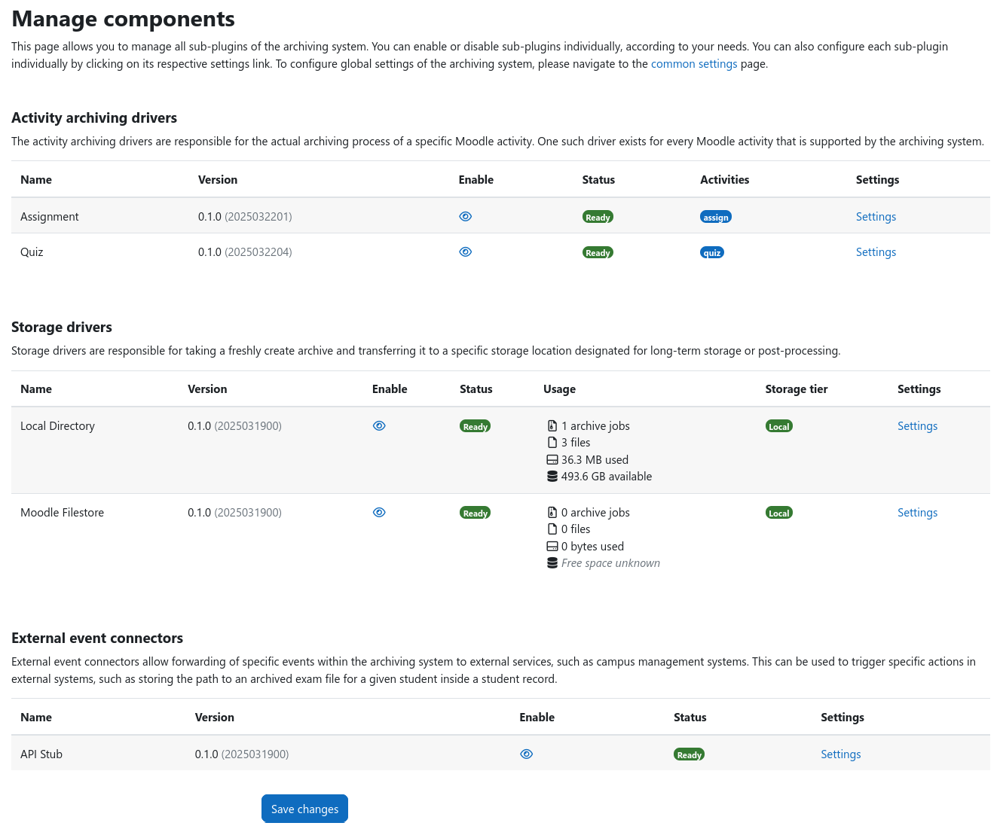

# Archiving Subsystem for Moodle

[%7D&replace=%24%3Cdata%3E&label=PHP&color=blue)](https://github.com/ngandrass/moodle-local_archiving/blob/master/version.php)
[%7D&replace=%24%3Cdata%3E&label=Moodle&color=orange)](https://github.com/ngandrass/moodle-local_archiving/blob/master/version.php)

A Moodle plugin that archives student data for long-term storage. It provides an extensible framework for archiving data
from various Moodle activities, such as quizzes and assignments, and transferring it to different storage locations,
such as the Moodle file store or external storage systems.

More information about the project, its features, screenshots, and installation instructions can be found in the
[official documentation](https://archiving.gandrass.de/).

## Installation and Configuration

You can find detailed installation and configuration instructions within the
[official documentation](https://archiving.gandrass.de/).

If you're having problems installing the archiving subsystem or have further questions, please feel free to open an
issue within the [GitHub issue tracker](https://github.com/ngandrass/moodle-local_archiving/issues).

## Screenshots

This section contains various screenshots of the archiving subsystem core as well as examples from the available
sub-plugins. The screenshots shown here do not cover the full depth of the plugins functionality, but they should give
you a good first impression of the plugin and its features.

### User interface

This section contains screenshots of the pages that are visible to managers.

#### Course archiving overview page

#### Creating a new archive

#### Downloading archived data

#### Inspecting archive job logs

### Archive contents

This section contains example screenshots of archived data.

#### Example of PDF report (excerpt)

### Admin interface and settings

This section contains screenshots of the admin interface and some configuration options.

#### Manage components

#### Common settings

#### Quiz archiving presets (excerpt)

## License

2025 Niels Gandraß <niels@gandrass.de>

This program is free software: you can redistribute it and/or modify it under
the terms of the GNU General Public License as published by the Free Software
Foundation, either version 3 of the License, or (at your option) any later
version.

This program is distributed in the hope that it will be useful, but WITHOUT ANY
WARRANTY; without even the implied warranty of MERCHANTABILITY or FITNESS FOR A
PARTICULAR PURPOSE.  See the GNU General Public License for more details.

You should have received a copy of the GNU General Public License along with
this program.  If not, see <https://www.gnu.org/licenses/>.
