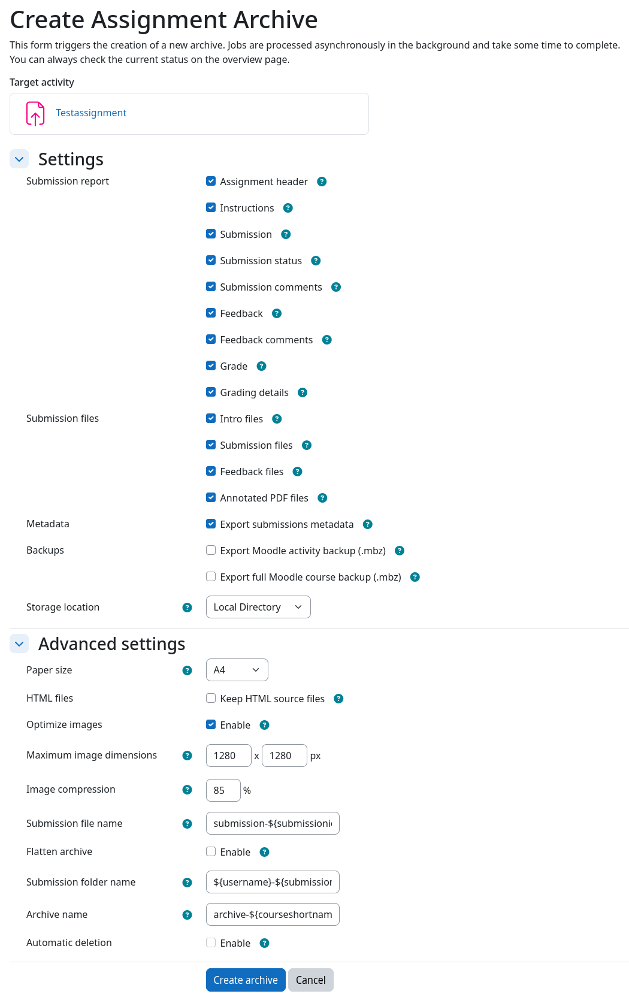
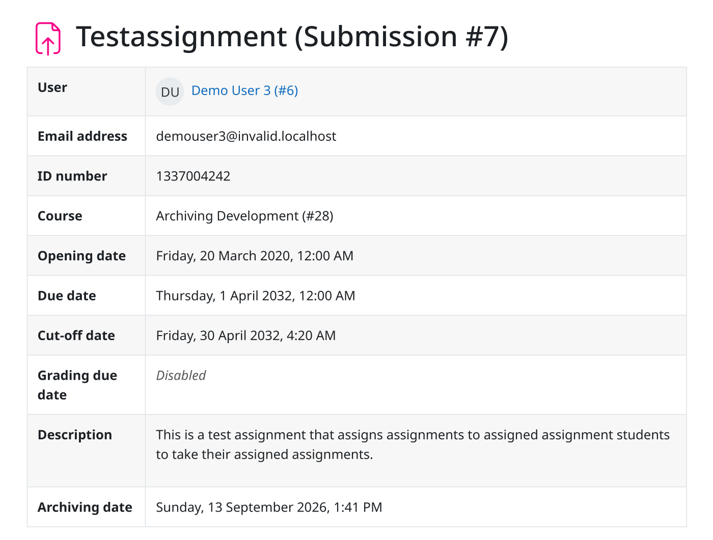
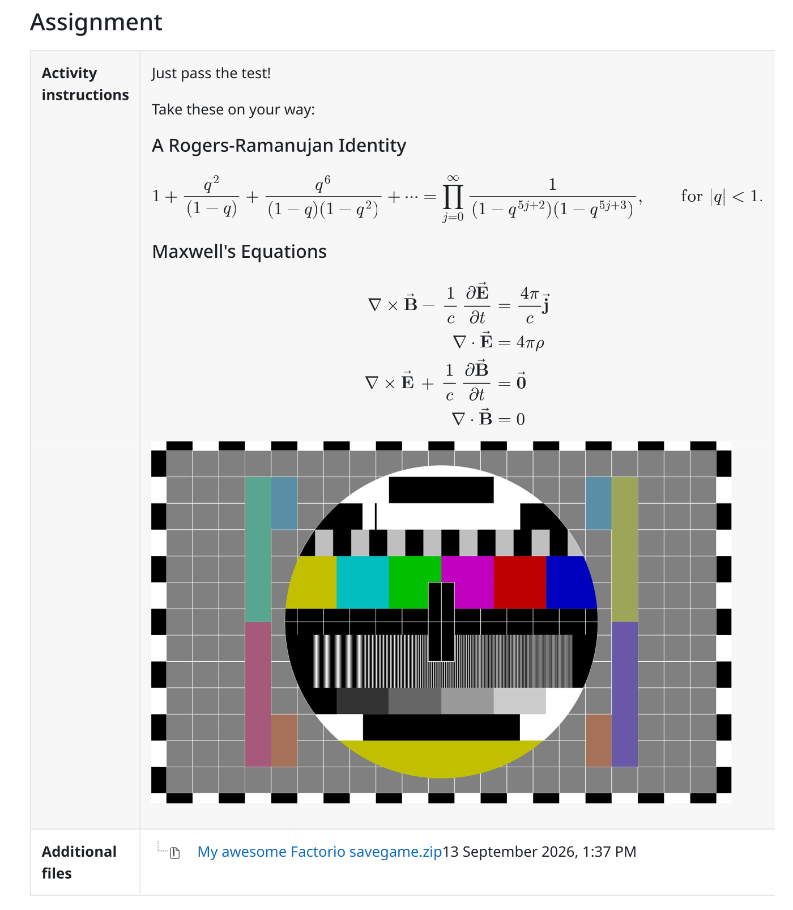
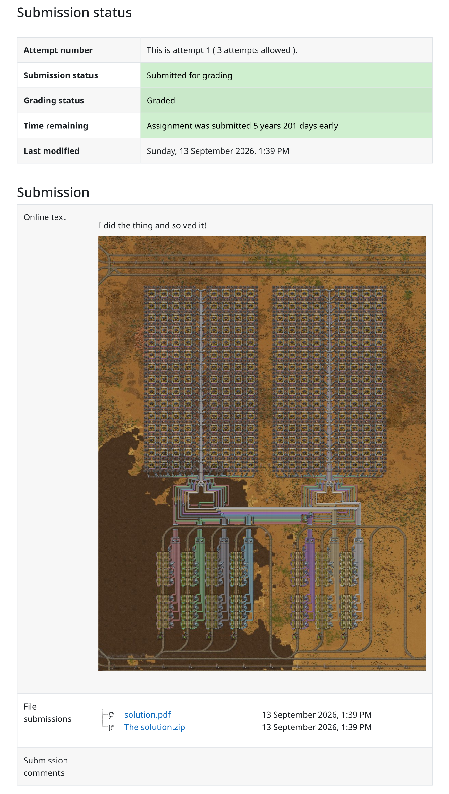
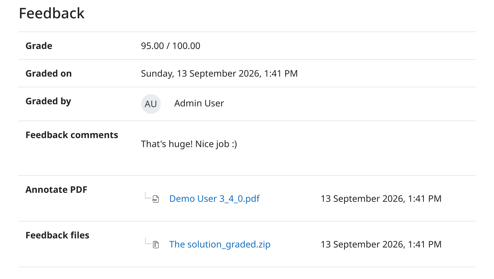
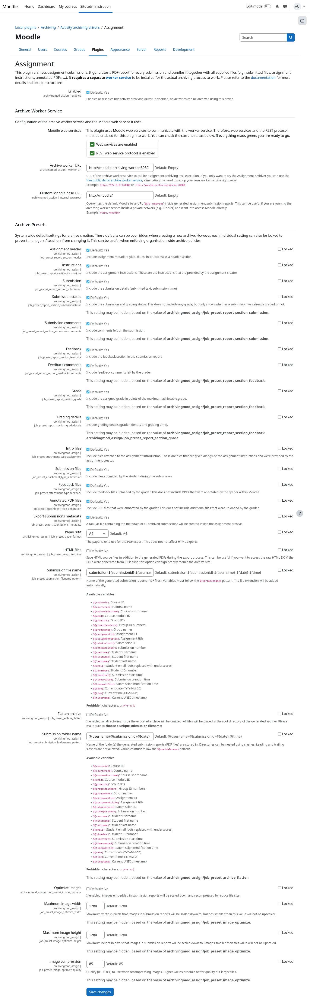

# Screenshots

This page contains screenshots of the assignment archiving driver. They depict the available options and various
non-exhaustive examples of exported assignment submission reports.

!!! tip "View screenshots in full size"
    You can click on any of the screenshots below to view them in full size.

## Archive creation form

## Submission report header

## Assignment instructions

## Submission details

## Grader feedback

## Plugin admin settings

