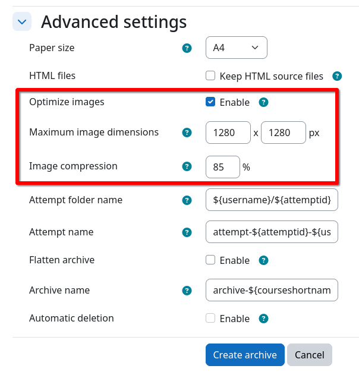

# Image optimization

If quizzes contain a large number of images or images with an excessively high resolutions (e.g., 4000x3000 px), the
archive worker can optionally compress such images during archiving. This can significantly reduce the size of the
generated PDF files. HTML source files, if generated, are never modified and remain untouched.

To enable image optimization for a quiz archive job:

1. Navigate to the quiz archive job creation page.
2. Expand the {{ mform_element('Advanced settings', 'section') }} section at the bottom of the form.
3. Check the {{ mform_element('Optimize images', 'checkbox') }} checkbox.
4. Set the desired maximum dimensions and quality below.
    - If an image exceeds any of the specified dimensions, it will be resized proportionally to fit within the specified
      bounds.
    - The quality setting controls the compression level of the images. A value of 100% will result in no compression,
      while a value of 0% will result in the lowest quality and smallest file size. A value of 85% is a good compromise
      between quality and file size.
5. Continue with the archive creation as usual.

{ .img-thumbnail }

!!! info "Suggestion"
    It is strongly advised to lock image quality settings to global defaults using the
    [archive job presets](../../setup/config/job-presets.md).
