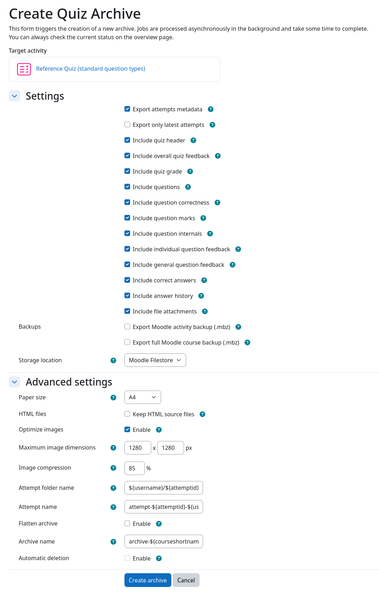
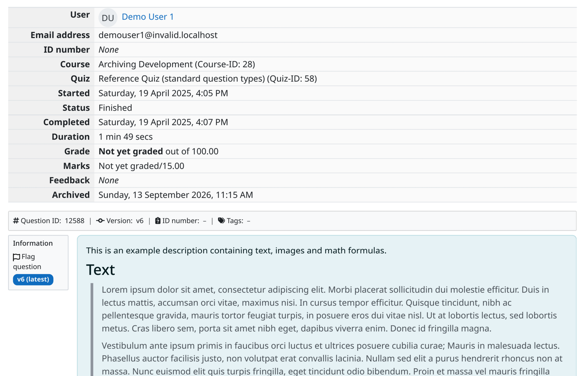
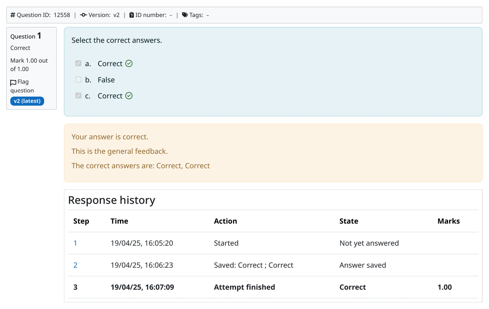
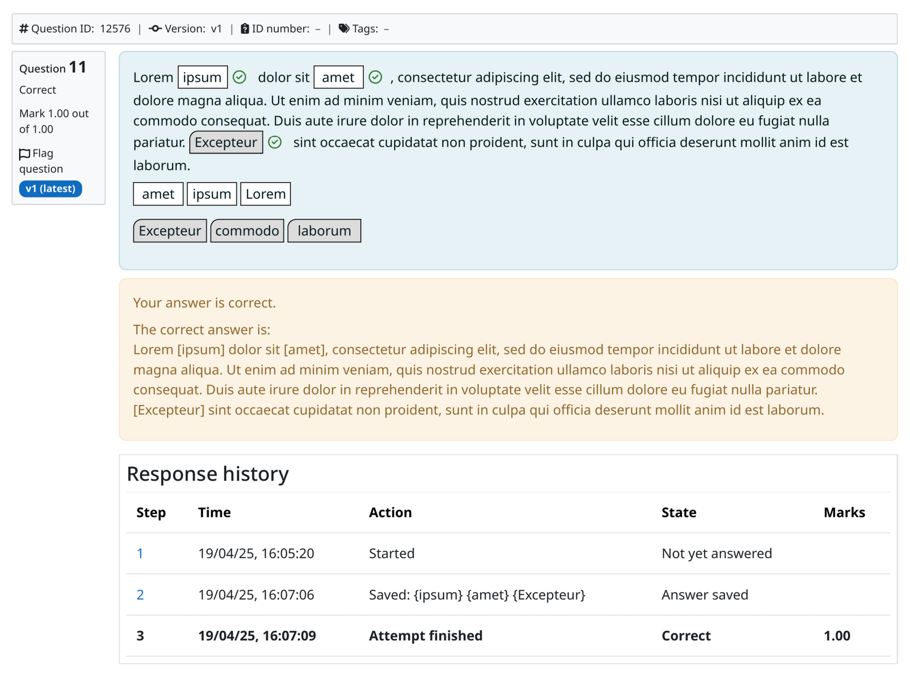
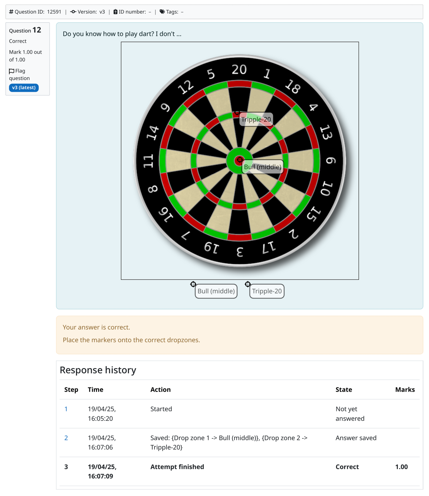
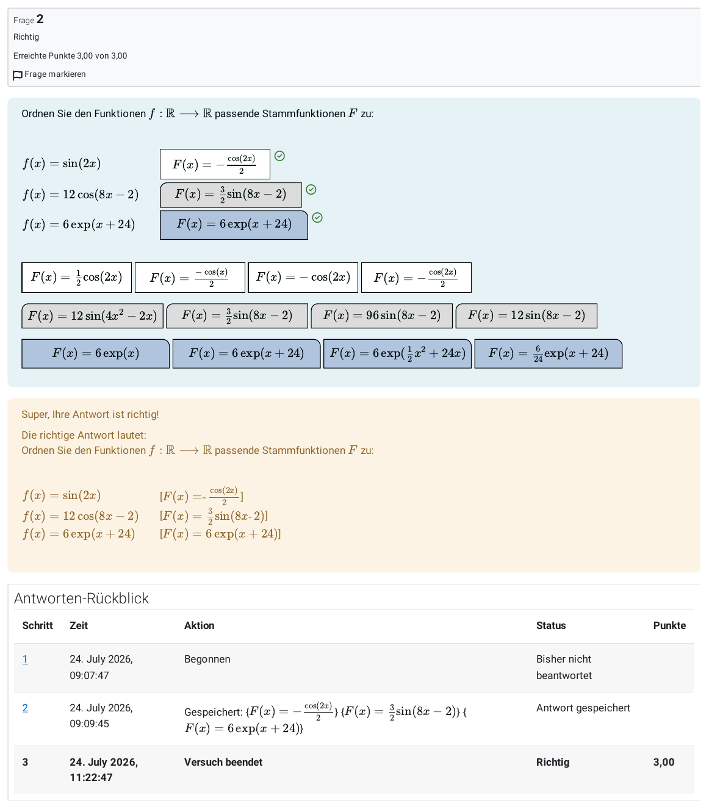
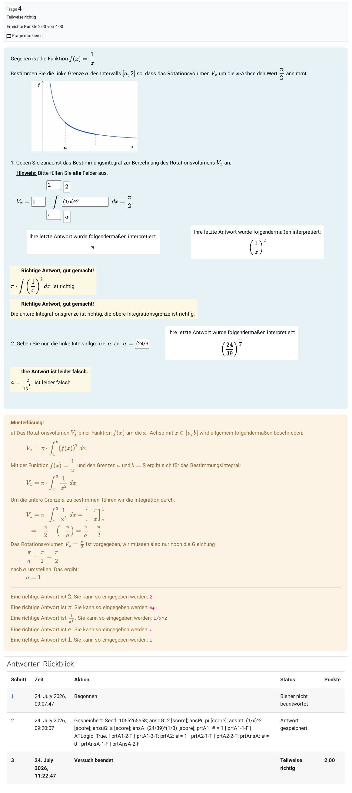
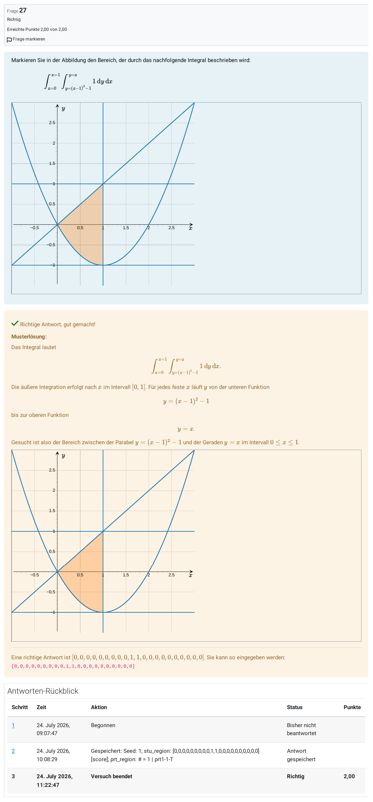
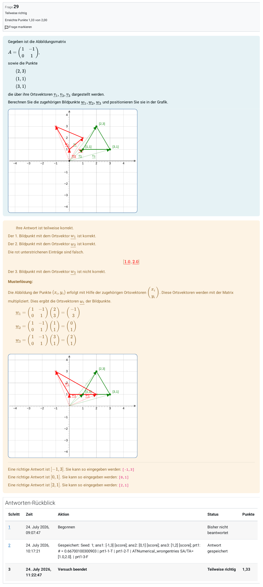
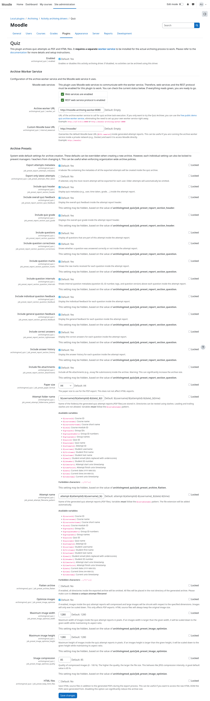

# Screenshots

This page contains screenshots of the quiz archiving driver. They depict the available options and various
non-exhaustive examples of exported quiz attempt reports.

!!! tip "View screenshots in full size"
    You can click on any of the screenshots below to view them in full size.

## Archive creation form

## Quiz report header

## Multi choice question

## Cloze / matching question

## Drag-and-drop question

## LaTeX drag-and-drop question

## STACK question

## Interactive graph question

## JSXGraph question

## Plugin admin settings

