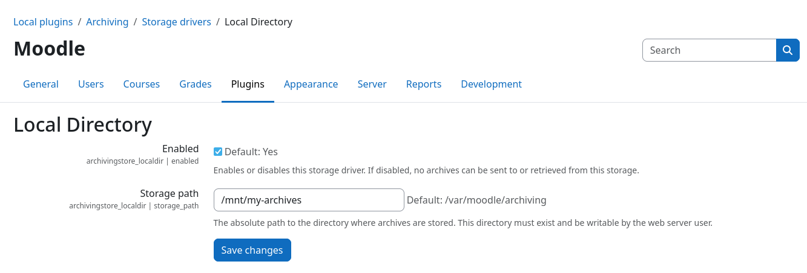

# Storage Driver: Local Directory

This storage driver stores all files inside a configurable local directory on the server. This not only allows you to
easily store files outside your Moodle filestore, but also enables you to write files directly to a mounted network
share (e.g., [NFS](https://en.wikipedia.org/wiki/Network_File_System) or
[SMB/CIFS](https://en.wikipedia.org/wiki/Server_Message_Block)). 


## Configuration

Even though this storage driver is usable with its default settings, it is strongly encouraged to change the target
directory according to your needs before use.



You can set the target directory via the {{ mform_element('Storage path', 'text') }} field within the plugin settings 
page.

If you want to prevent users from storing archives on the local filesystem, you can disable this storage driver on the
[components overview page](../setup/config/components.md) or via the {{ mform_element('Enable', 'checkbox') }} checkbox
on the plugin settings page.


## File structure

All files are grouped by archive job and stored inside subdirectories of the {{ mform_element('Storage path', 'text') }}
directory. Subdirectories are automatically created for each archive job, called `job-{$jobid}`. All files
associated with the respective archive job are stored inside this subdirectory.

!!! example "Example directory structure"
    ```
    /storage/path/
    ├── job-42/
    │   ├── My Quiz_2026-01-01.zip
    │   ├── backup_moodle2_My Quiz_2026-01-01.mbz
    │   └── ...
    ├── job-43/
    │   ├── Hard Assignment_2026-01-03.zip
    │   ├── backup_moodle2_Hard Assignment_2026-01-03.mbz
    │   └── ...
    └── ...
    ```
