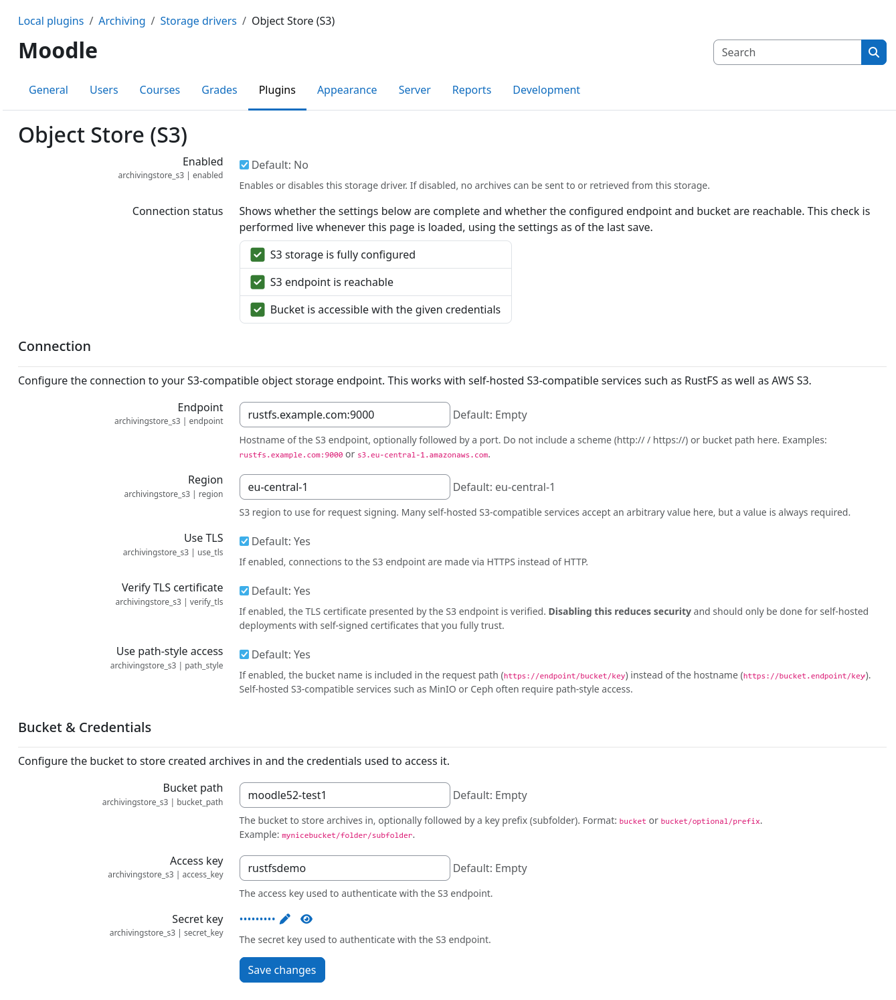
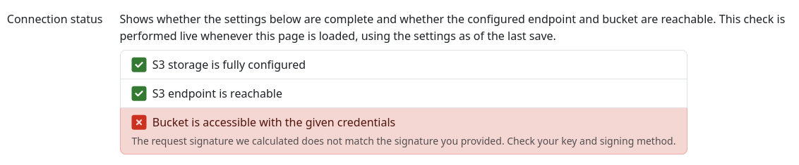

# Storage Driver: S3 Object Store

This storage driver allows you to transfer created archives to any S3 compatible object store. This includes
[RustFS](https://rustfs.com/), [MinIO](https://min.io/), [Ceph](https://ceph.io/), and
[Amazon S3](https://en.wikipedia.org/wiki/Amazon_S3). All files are automatically transferred to the configured S3
bucket during the archive job execution.

By default, no local copies of the archives are kept on the Moodle server. However, you can fetch all files from the
object store via the Moodle web interface and download them as usual. This process happens asynchronously in the
background including progress reporting for both store and retrieve operations.


## Configuration

Prior to first use, this plugin needs to be configured with the connection details of your S3 object store. You will
need the following information:

1. The S3 endpoint URL, stored in the {{ mform_element('Endpoint', 'text') }} field
2. The bucket name, stored in the {{ mform_element('Bucket path', 'text') }} field
3. The access key, stored in the {{ mform_element('Access key', 'text') }} field
4. The secret key, stored in the {{ mform_element('Secret key', 'password') }} field

The following screenshot depicts the plugins settings page with all configuration fields:


### Bucket region

The S3 protocol requires a bucket region to be set for all requests. When using AWS S3, this is the region where your
bucket is located. For other S3 compatible object stores this can be an arbitrary string, but is still required. Most
object stores accept any value here. In case of doubt, please refer to your object store provider's documentation.

### Encryption

By default, all files are always transferred encrypted using TLS. You can control this behavior via the
{{ mform_element('Use TLS', 'checkbox') }} and {{ mform_element('Verify TLS certificate', 'checkbox') }} settings.
Transfering files over an unencrypted connection is strongly discouraged and should only be used for testing purposes.

### Path style vs. virtual host style access

You can switch between path style and virtual host style access via the {{ mform_element ('Use path-style access',
'checkbox') }} setting. Please refer to your object store provider's documentation for more information about the
differences between these two access styles.

### Request signing

This storage driver uses
[AWS Signature Version 4 (SigV4)](https://docs.aws.amazon.com/IAM/latest/UserGuide/reference_sigv.html) for signing all
requests. The deprecated SigV2 is not supported.


## Connection status checks

Once you have fully configured the S3 storage driver, an automated connection status check will be performed whenever
you visit the plugin settings page. This will verify the following things:

1. The storage driver is **configured** with all required information
2. The S3 endpoint is **reachable**
3. The credentials are valid and have sufficient **permissions** to access the configured bucket

If any of these checks fail, an error message will be displayed on the plugin settings page with detailed information
about the cause. Please check the error message and adjust your configuration accordingly.

Example error message with invalid credentials or insufficient permissions:



## File structure

All files are grouped by archive job and stored inside the {{ mform_element('Bucket path', 'text') }} bucket (and
sub-path). All files associated with a respective archive job will be prefixed with `job-{$jobid}/` in the object store.
This allows you to easily identify and manage files associated with a specific archive job.

!!! example "Example path structure"
    ```
    https://my-object.store.example.org/examdata/archives/
    ├── job-42/
    │   ├── My Quiz_2026-01-01.zip
    │   ├── backup_moodle2_My Quiz_2026-01-01.mbz
    │   └── ...
    ├── job-43/
    │   ├── Hard Assignment_2026-01-03.zip
    │   ├── backup_moodle2_Hard Assignment_2026-01-03.mbz
    │   └── ...
    └── ...
    ```


## Usage quota reporting

The archive driver supports reporting the number of files and the total size of all files stored in the object store.
However, the amount of free space can not be reported since this is not transparently available via the S3 protocol.
Please check your object store provider for up-to-date information about your usage quota and available space.
