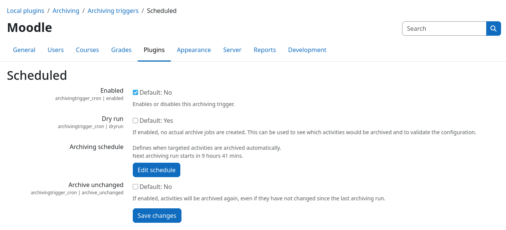

# Archiving Trigger: Scheduled

The scheduled archiving trigger periodically checks for activities that have unarchived changes and creates respective
archiving jobs for them. The trigger uses the Moodle cron system to run at a configurable interval.

!!! warning "Plugin must be configured before use"
    To prevent accidental creation of a large number of archive jobs, this archiving trigger is **disabled by default**.
    Please configure it as described below and only enable it after you have verified your configuration.

## Dry-run mode

After installation, the plugin will be in dry-run mode by default, as controlled by the {{ mform_element('Dry
run', 'checkbox') }} setting. In this mode, the scheduled task `\archivingtrigger_cron\task\trigger_archiving` will
analyze existing activities and log which activities need to be archived, but it will **not** create any archive jobs.
This allows you to verify that the plugin is working correctly and that the correct activities are being identified for
archiving.

Make sure to also **enable** the plugin via the {{ mform_element ('Enabled', 'checkbox') }} checkbox, so that the
scheduled task is executed. If the plugin is not enabled, no dry-run will be performed.

## Selecting the scope of activities to check

The scheduled trigger will check all supported activities that reside within courses that are marked for archiving. The
archiving scope is controlled by the {{ mform_element('Course categories', 'select') }} setting that can be found in the
core plugin common settings page: {{ moodle_nav_path('Site administration', 'Plugins', 'Local plugins', 'Archiving',
'Common settings') }}.

!!! info "Duplicate archiving jobs are prevented"
    Prior to creating a new archive job, the plugin checks if there is already an existing archive job for the same
    activity. If such a job exists, no new job will be created. This prevents duplicate archiving jobs from being
    created for the same activity.

## Execution schedule

The check interval is controlled by the Moodle cron system. The {{ mform_element('Edit schedule', 'button') }} button
takes you directly to the Moodle cron settings page that allows you to change the execution schedule of the underlying
task. Activities are checked whenever the scheduled task is executed.

## Force re-archiving

By default, the scheduled trigger will only create archive jobs for activities that have unarchived changes. If you want
to force the creation of archive jobs for all activities, regardless of whether they have unarchived changes or not, you
can enable the {{ mform_element('Force re-archiving', 'checkbox') }} setting. This will cause the scheduled trigger to
create archive jobs for all activities that are within courses marked for archiving, even if they have no unarchived
changes.
