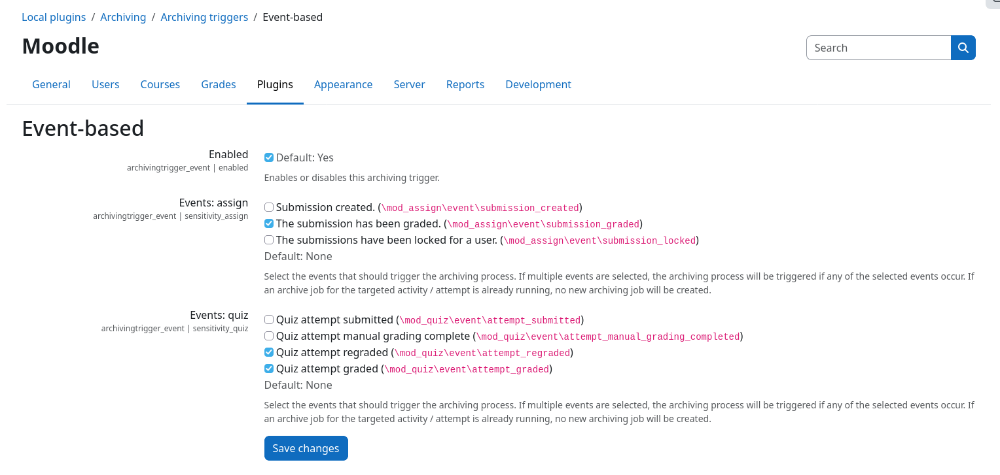

# Archiving Trigger: Event-based

The event-based archiving trigger automatically creates archive jobs whenever configured Moodle events occur, e.g., when
a student submits a quiz attempt or when an assignment submission gets graded.

Instead of archiving the whole activity, the created archive job only targets the specific object that is referenced by
the event (e.g., the submitted quiz attempt or the graded assignment submission). This allows to archive individual
attempts or submissions in a timely manner, right after they were created or changed, without having to wait for a
scheduled run or manual user interaction.

!!! warning "Plugin must be configured before use"
    To prevent accidental creation of a large number of archive jobs, this archiving trigger is **disabled by default**.
    Please configure it as described below and only enable it after you have verified your configuration.

## Configuration

All settings of this archiving trigger can be found at {{ moodle_nav_path('Site administration', 'Plugins', 'Local
plugins', 'Archiving', 'Archiving triggers', 'Event-based') }}.

### Selecting events

For every enabled [activity archiving driver](../archivingmod/index.md) that supports event-based archiving, a separate
event selector is shown (e.g., {{ mform_element('Events: quiz', 'checkbox') }} for quizzes). It lists all Moodle events
that can be used to automatically trigger new archive jobs. If multiple events are selected, an archive job is created
whenever any of the selected events occurs.

The following events are currently supported:

| Activity   | Event                                                 | Archived object                      |
|------------|-------------------------------------------------------|--------------------------------------|
| Quiz       | `\mod_quiz\event\attempt_submitted`                   | The submitted quiz attempt           |
| Quiz       | `\mod_quiz\event\attempt_graded`[^1]                  | The graded quiz attempt              |
| Quiz       | `\mod_quiz\event\attempt_regraded`                    | The regraded quiz attempt            |
| Quiz       | `\mod_quiz\event\attempt_manual_grading_completed`    | The manually graded quiz attempt     |
| Assignment | `\mod_assign\event\submission_created`                | The created submission               |
| Assignment | `\mod_assign\event\submission_graded`                 | The graded submission                |
| Assignment | `\mod_assign\event\submission_locked`                 | The submission of the locked student |

[^1]: The `attempt_graded` event is only available in Moodle 5.0 and newer. In Moodle 4.5, grading of quiz attempts is
      covered by the `attempt_submitted` event.

### Limiting the scope of activities

Like the [scheduled trigger](cron.md), the event-based trigger only creates archive jobs for activities that reside
within courses that are marked for archiving. The archiving scope is controlled by the {{ mform_element('Course
categories', 'select') }} setting that can be found in the core plugin common settings page: {{ moodle_nav_path('Site
administration', 'Plugins', 'Local plugins', 'Archiving', 'Common settings') }}.

### Archive job settings

Archive jobs that are created by this trigger use the default values of the respective activities
[archive job presets](../setup/config/job-presets.md). Make sure to configure the job presets according to your needs
(e.g., storage driver, retention time, file naming patterns, ...) before enabling any events.

## Duplicate prevention

Some events can occur multiple times in short succession, e.g., when a teacher grades a submission and then updates the
grade again. To prevent the creation of redundant archive jobs, each archive job is assigned a fingerprint that is
based on the targeted course, activity, job settings, and archived objects. If an identical archive job is still
pending or currently being processed, no new archive job will be created.

Once the previous archive job has finished, the next matching event will create a new archive job again. This ensures
that later changes, e.g., a regrading of a quiz attempt, are captured inside a new archive.

## Traceability

Each archive job created by this trigger records the Moodle event that caused its creation, as well as the IDs of the
targeted objects (e.g., quiz attempt IDs or assignment submission IDs), inside its [job logs](../usage/logs.md). The
used archiving trigger can furthermore be found in the job metadata table on the job logs page.

## Combining triggers

The event-based trigger can be used alongside all other archiving triggers. You can, for example, archive every
quiz attempt right after its submission using this trigger, while still allowing teachers to [manually](manual.md)
create full archives of an activity or creating them automatically on a [schedule](cron.md).
