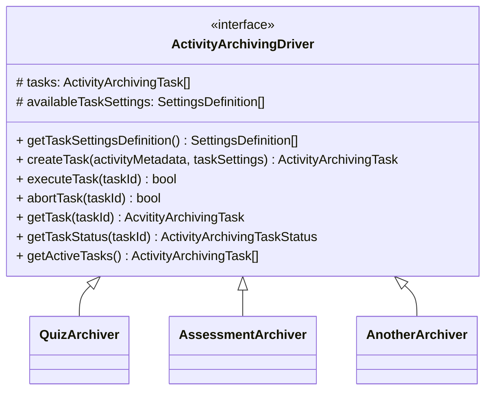

# Activity Archiving Drivers

This document defines the interface that [activity archiving driver](../../components/activity-archiving-drivers.md)
implementations must adhere to.

!!! warning "Work in Progress (WIP)"
    This section is still under active development. Information and specifications can still be changed in the future.

## Overview

## Attributes

### `tasks: ActivityArchivingTask[]`

Holds a list of all tasks known to the activity archiving driver. This should be stored in the database.

### `availableTaskSettings: SettingsDefinition[]`

Holds a list of all settings and configuration arguments that this activity archiving driver supports. These include,
but are not limited to:

- Scope selectors (e.g., quiz attempt IDs)
- Export data customizations (e.g., including example solutions)
- File format settings
- File naming patterns
- Paper size settings

## Methods

This section contains descriptions for the methods defined in the interface above.

### `getTaskSettingsDefinition()`

Returns the `availableTaskSettings` attribute. This is used by an initiator to build the config object for a specific
activity archiving task.

### `createTask(activityMetadata, taskSettings)`

Creates a new activity archiving task, targeting the activity specified in `activityMetadata` with the respective
`taskSettings`.

### `executeTask(taskId)`

Schedules a prior-created task for execution.

### `abortTask(taskId)`

Gracefully aborts a task that is currently being executed.

### `getTask(taskId)`

Returns the task object for a given task ID.

### `getTaskStatus(taskId)`

Returns the current status of a task.

### `getActiveTasks()`

Returns a list of all tasks that are currently are scheduled for execution or are currently executed.
