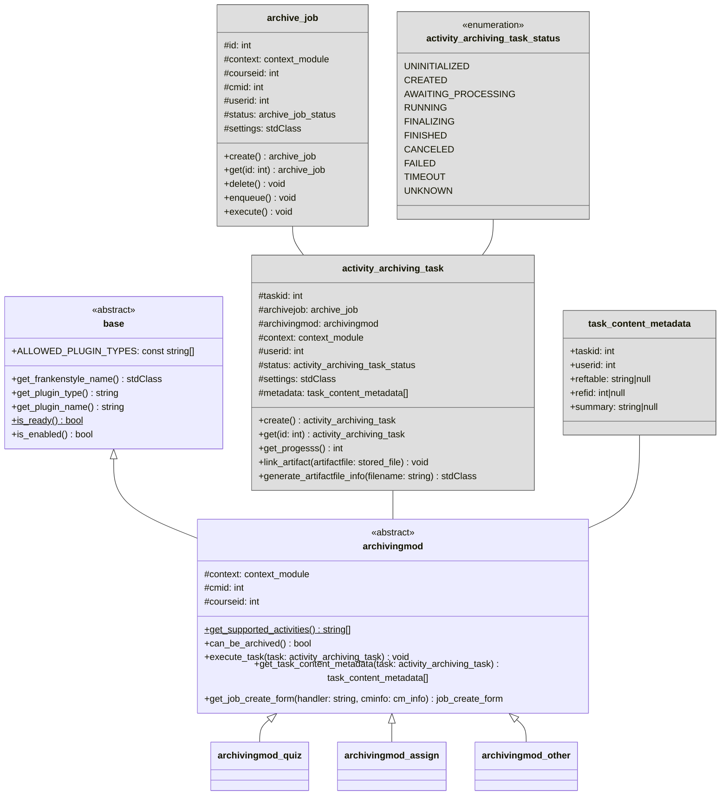

# Activity Archiving Drivers

This document defines the interface that [activity archiving driver](../components/activity-archiving-drivers.md)
implementations must adhere to.

## Overview

The abstract driver base class for activity archiving drivers is {{ source_file('classes/driver/archivingmod.php',
'\\local_archiving\\driver\\archivingmod') }}.

!!! notice "Overview reduced for bravery"
    For bravery, the following overview diagram is reduced to the most important classes and members. Therefore, some 
    details like methods, parameters, or members are omitted. Please refer to the {{ source_file('', 'plugin source code') }}
    for a complete reference.
    

## Implementation

Each activity archiving driver must implement the {{ source_file('classes/driver/archivingmod.php',
'\\local_archiving\\driver\\archivingmod') }} interface with a class, placed at the following location:
`/local/archiving/driver/mod/<pluginname>/classes/archivingmod.php`, where `<pluginname>` is the name of the activity
archiving driver (e.g., `quiz`, `assign`, ...).

Each activity archiving driver specifies the mod types that it supports via the `get_supported_activities()` method.
During creation, each activity archiving driver instance is bound to a specific activity instance by its respective
module context (`\context_module`). The method `can_be_archived()` is then used to determine whether the
targeted activity is ready to be archived or not.

When creating a new archive job, the method `get_job_create_form()` returns the Moodle form that is presented to the
user upon archive job creation, containing all necessary options for the activity archiving task of the targeted activity.
All form data will be stored inside the created archive job and can be accessed via the job settings API.

After creation and once scheduled for execution, the archiving manager will call the `execute_task()` method of the
activity archiving driver with the activity archiving task that should be processed. If an task executor yields before
the job is finished, it will be re-executed periodically until it is either finished or canceled. Lastly, at any point
in time, the `get_task_content_metadata()` method can be used to retrieve metadata about the data that is being targeted
by a specific activity archiving task. This metadata will be processed by the archiving manager and stored inside the
archive jobs metadata record.
