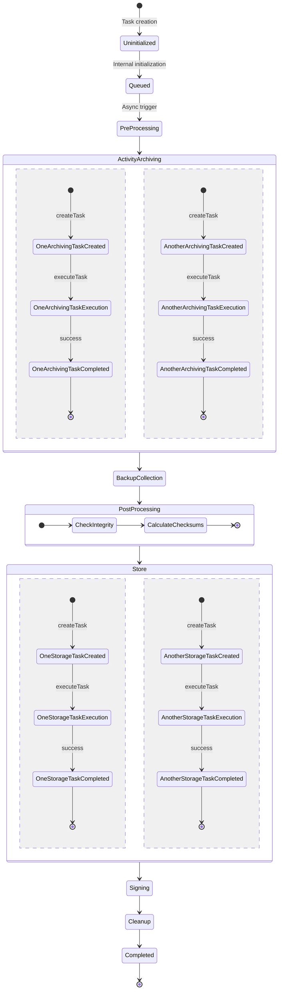
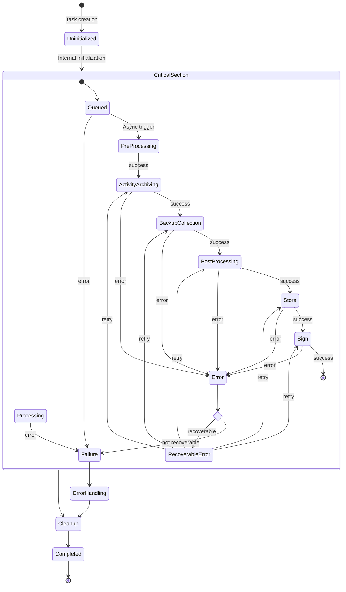

# Archive Job States

This document describes the states an archive job can be in and the transitions between them. Archive jobs are created
and managed by the [archiving manager](../../components/archiving-manager.md).

A complete list of all valid archive job states is defined in {{ source_file('classes/type/archive_job_status.php', 
'\\local_archiving\\type\\archive_job_status') }}.

## Overview

This section provides insight into different states an archive job can be in and the transitions between them.

### Successful Job

The following state diagram shows the successful execution of an archive job. The job is created, initialized, and
fully processed.

### Error Handling

The following state diagram shows the error handling process for an archive job. Each non-recoverable error within the
critical section will cause archive job to fail.

## States

This section describes the different states an archive job can be in.

### Uninitialized

A newly created archive job is in the `UNINITIALIZED` state. It is not yet ready to be processed and needs to be fully
initialized by the archiving manager.

### Queued

The `QUEUED` state indicates that the archive job is ready to be processed. It is waiting for an asynchronous trigger,
such as cron, to start the processing.

### Pre-Processing

The `PRE_PROCESSING` state indicates that an archive job was just popped from the queue and started pre-processing work,
such as preparation of internal data structures or settings checks.

### Activity Archiving

In the `ACTIVITY_ARCHIVING` state, the activity archiving drivers are extracting and processing the data to be archived
from the different activities.

### Backup Collection

During the `BACKUP_COLLECTION` phase, asynchronously generated Moodle backups are collected and prepared for storage
inside the archive.

### Post Processing

During `POST_PROCESSING`, artifacts from the `ACTIVITY_ARCHIVING` and `BACKUP_COLLECTION` phase are gathered, verified
and post-processed.

### Store

In the `STORE` phase, the finalized archive files are transferred to the final storage location(s).

### Signing

If enabled, the `SIGNING` phase will issue cryptographic signatures for all archive artifact files and store them as
file metadata for later use.

### Cleanup

Internal cleanup phase. The `CLEANUP` state can be used for deleting temporary files and other housekeeping tasks.

### Completed

If an archive job reached the `COMPLETED` state, the job has been successfully processed. This state is final.

### Error

The `ERROR` state indicates that an error occurred during the processing of the archive job. This state determines if
the error is recoverable or not. Every recoverable error is classified as a `FAILURE` after a certain number of failed
retries.

### RecoverableError

The `RECOVERABLE_ERROR` state indicates that a potentially recoverable error happened. The archiving manager will try to
recover from the error and re-executes the failed tasks.

### Failure

The `FAILURE` state indicates that a non-recoverable error occurred during the processing of the archive job. Jobs in
this state can never be completed successfully. This state is final.

### ErrorHandling

If a non-recoverable error occured, the `ERROR_HANDLING` state allows for proper handling of such errors, e.g., finally
failed archive jobs. It can be used to send various signals and error-specific cleanup tasks.

### Timeout

If an archive job runs into a timeout, it will transition into the `TIMEOUT` state. This state is final.
