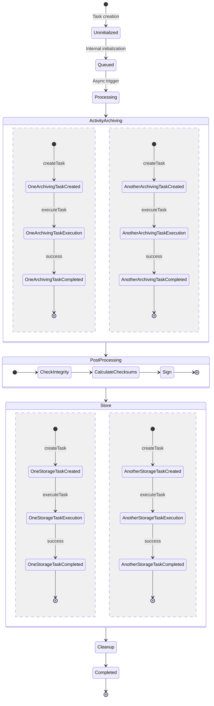
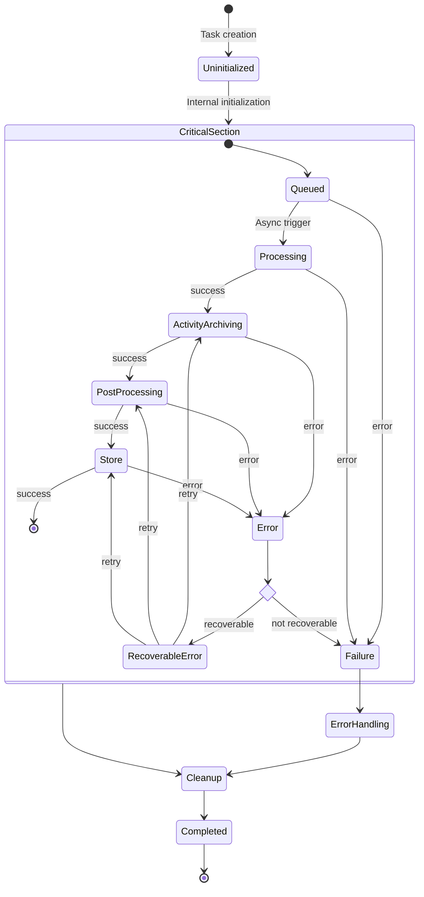

# Archive Job States

This document describes the states an archive job can be in and the transitions between them. Archive jobs are created
and managed by the [archiving manager](../../components/archiving-manager.md).

!!! warning "Work in Progress (WIP)"
    This section is still under active development. Information and specifications can still be changed in the future.

## Overview

This section provides insight into different states an archive job can be in and the transitions between them.

### Successful Job

The following state diagram shows the successful execution of an archive job. The job is created, initialized, and
fully processed.

### Error Handling

The following state diagram shows the error handling process for an archive job. Each non-recoverable error within the
critical section will cause archive job to fail.

## States

This section describes the different states an archive job can be in.

### Uninitialized

A newly created archive job is in the `Uninitialized` state. It is not yet ready to be processed and needs to be fully
initialized by the archiving manager.

### Queued

The `Queued` state indicates that the archive job is ready to be processed. It is waiting for an asynchronous trigger,
such as cron, to start the processing.

### Processing

The `Processing` meta state indicates that an archive job is currently being processed. This meta state is active until
the job is either finished successfully or failed.

### ActivityArchiving

In the `ActivityArchiving` state, the activity archiving drivers are extracting and processing the data to be archived
from the different activities.

### PostProcessing

During `PostProcessing`, artifacts from the `ActivityArchiving` phase are collected, verified and post-processed.

### Store

In the `Store` phase, the finalized archive is transferred to the final storage location(s).

### Cleanup

Internal cleanup phase. Can be used to delete temporary files and other housekeeping tasks.

### Completed

The archive job has been successfully processed. This state is final.

### Error

The `Error` state indicates that an error occurred during the processing of the archive job. This state determines if
the error is recoverable or not. Every recoverable error is classified as a `Failure` after a certain number of failed
retries.

### RecoverableError

This state indicates that a potentially recoverable error happened. It tries to recover from the error and re-executes
the failed tasks.

### Failure

The `Failure` state indicates that a non-recoverable error occurred during the processing of the archive job. Jobs in
this state can never be completed successfully.

### ErrorHandling

Allows proper handling of non-recoverable errors, e.g., finally failed archive jobs. It can be used to send various
signals and error-specific cleanup tasks.
