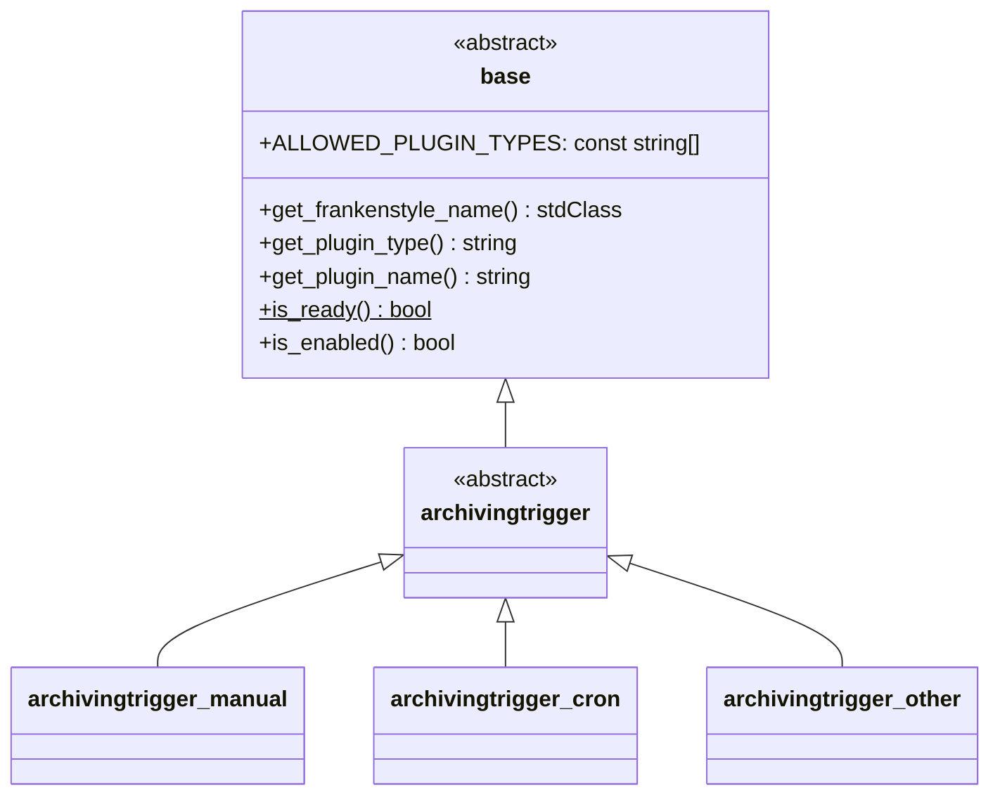

# Archiving Triggers

This document defines the interface that [archiving trigger](../components/archiving-triggers.md)
implementations must adhere to.

## Overview

The abstract driver base class for archiving triggers is {{ source_file('classes/driver/archivingtrigger.php',
'\\local_archiving\\driver\\archivingtrigger') }}.

!!! notice "Overview reduced for bravery"
    For bravery, the following overview diagram is reduced to the most important classes and members. Therefore, some
    details like methods, parameters, or members are omitted. Please refer to the {{ source_file('', 'plugin source code') }}
    for a complete reference.

## Implementation

Each archiving trigger must implement the {{ source_file('classes/driver/archivingtrigger.php', '\\local_archiving\\driver\\archivingtrigger') }}
interface with a class, placed at the following location: `/local/archiving/driver/trigger/<pluginname>/classes/archivingtrigger.php`,
where `<pluginname>` is the name of the archiving trigger (e.g., `manual`, `cron`, ...).

Due to the flexible nature of archiving triggers, there are no common methods each trigger implementation must adhere to
besides the ones inherited from the base class.
