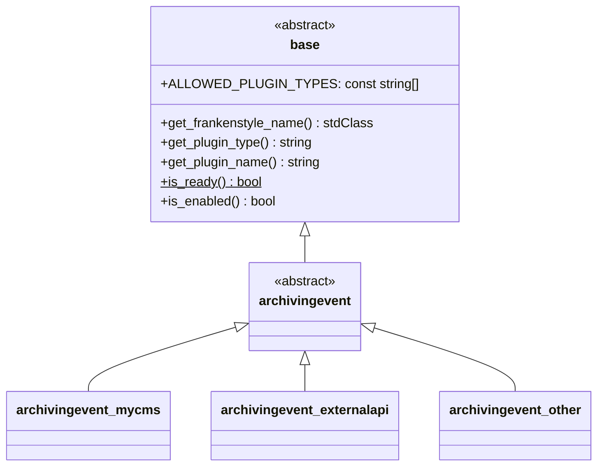

# External Event Connectors

This document defines the interface that [external event connector](../components/external-event-connectors.md)
implementations must adhere to.

!!! warning "Work in Progress (WIP)"
    This section is still under active development. Information and specifications can still be changed in the future.

## Overview

The abstract driver base class for external event connectors is {{ source_file('classes/driver/archivingevent.php',
'\\local_archiving\\driver\\archivingevent') }}.

!!! notice "Overview reduced for bravery"
    For bravery, the following overview diagram is reduced to the most important classes and members. Therefore, some
    details like methods, parameters, or members are omitted. Please refer to the {{ source_file('', 'plugin source code') }}
    for a complete reference.

## Implementation

Each external event connector must implement the {{ source_file('classes/driver/archivingevent.php', '\\local_archiving\\driver\\archivingevent') }}
interface with a class, placed at the following location: `/local/archiving/driver/event/<pluginname>/classes/archivingevent.php`,
where `<pluginname>` is the name of the external event connector (e.g., `mycms`, `externalapi`, ...).
