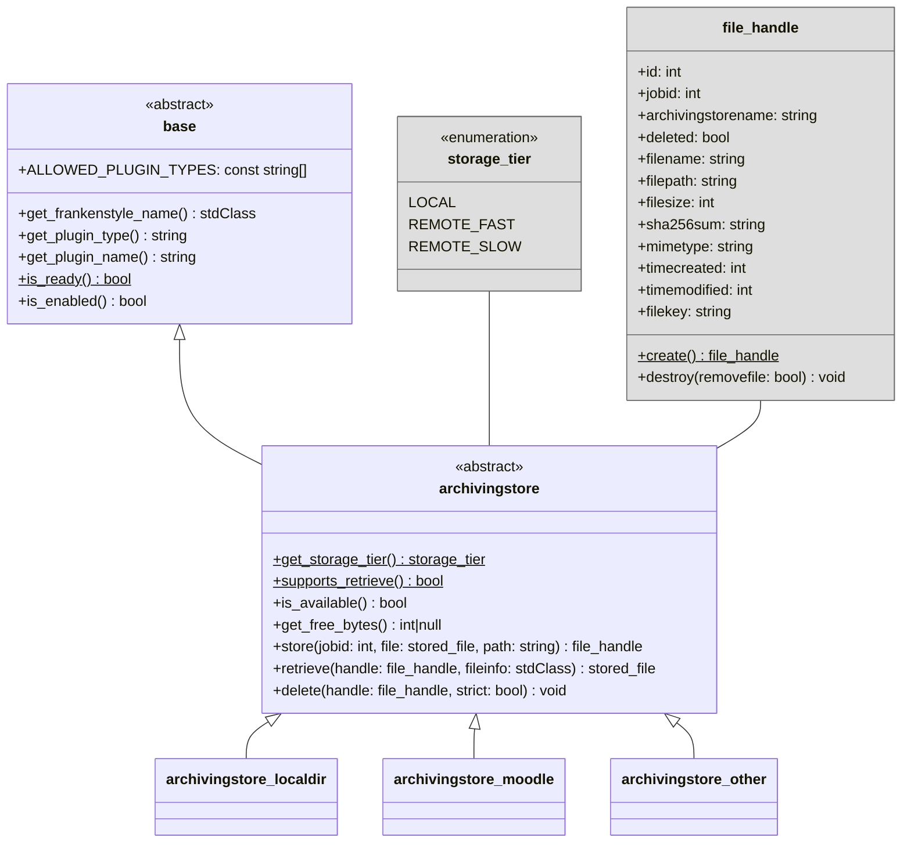

# Storage Drivers

This document defines the interface that [storage driver](../components/storage-drivers.md) implementations must adhere
to.

## Overview

The abstract driver base class for storage drivers is {{ source_file('classes/driver/archivingstore.php',
'\\local_archiving\\driver\\archvingstore') }}.

!!! notice "Overview reduced for bravery"
    For bravery, the following overview diagram is reduced to the most important classes and members. Therefore, some
    details like methods, parameters, or members are omitted. Please refer to the {{ source_file('', 'plugin source code') }}
    for a complete reference.

## Implementation

Each storage driver must implement the {{ source_file('classes/driver/archivingstore.php',
'\\local_archiving\\driver\\archivingstore') }} interface with a class, placed at the following location:
`/local/archiving/driver/store/<pluginname>/classes/archivingstore.php`, where `<pluginname>` is the name of the storage
driver (e.g., `localdir`, `moodle`, ...).

Storage is classified into different tiers ({{ source_file('classes/type/storage_tier.php', '\\local_archiving\\type\\storage_tier') }}),
which differentiate between local storage that is directly accessible and remote storage that is either fast or slow. If
a storage type does only support writing data but not retrieving it, a storage driver can indicate this via the
`supports_retrieve()` method.

Once a storage driver is initiated, it reports whether it is currently available for use via the `is_available()` method.
If supported, the number of free bytes within the storage are reported by the `get_free_bytes()` method.

Storing a new file via the `store()` method, requires the source file to be present within the Moodledata storage as an
instance of `\stored_file`. For every file, a {{ source_file('classes/file_handle.php', '\\local_archiving\\file_handle') }}
object is created that holds all relevant metadata to identify the referenced file in the target storage system. To
retrieve a previously stored file, the `retrieve()` method takes the information from the `file_handle` and tries to
load a copy of the referenced file into the Moodledata storage, according to the given `$fileinfo` record. This standard
Moodledata file record will be generated by the [archiving manager](../components/archiving-manager.md) and simply passed
to the storage driver. Never must a storage driver generate its own file record. 

If supported, existing files can be remove from the storage system via the `delete()` method. If working with previously
stored files, make sure to also destroy the corresponding `file_handle` object. It is recommended to access referenced
conveniently via the `file_handle` API instead of interfacing the underlaying storage driver directly.
