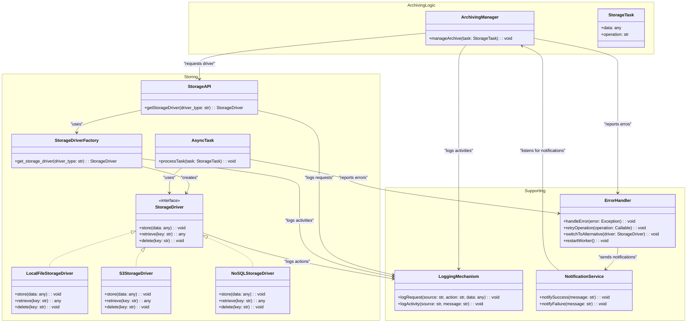

# Storage Drivers

This document defines the interface that [storage driver](../../components/storage-drivers.md) implementations must adhere
to.

!!! warning "Work in Progress (WIP)"
    This section is still under active development. Information and specifications can still be changed in the future.

## Overview

## Implemented Concepts

1. **Encapsulation of Storage Drivers through an API**  
   The StorageDriver implementations are abstracted behind an API that serves as a central entry point. This provides a
   clear separation between the logic for selecting drivers and their actual usage, enhancing maintainability and
   scalability.
2. **Asynchronous Communication and Callback Mechanism**  
   An asynchronous communication mechanism ensures efficient processing without blocking delays. Callback mechanisms
   allow receiving notifications, such as errors or successes, and facilitate exception handling.
3. **Extension Point via Strategy Pattern**  
   Using the Strategy Pattern enables the flexible integration of different storage solutions. New StorageDrivers can be
   added without modifying the existing application, simply by providing a new implementation.
4. **Logging / Notification Mechanism**  
   A logging mechanism records detailed information about what data was stored, when, and where. These logs support
   traceability of operations and assist in error analysis. Defines log and error levels and is responsible for managing
   the error status.
