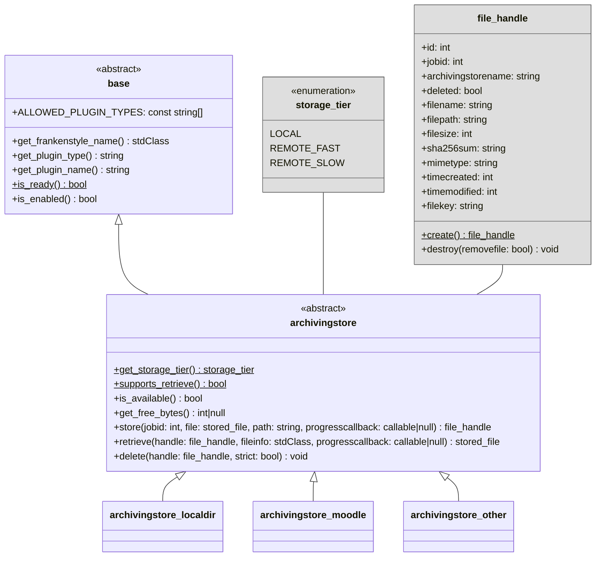
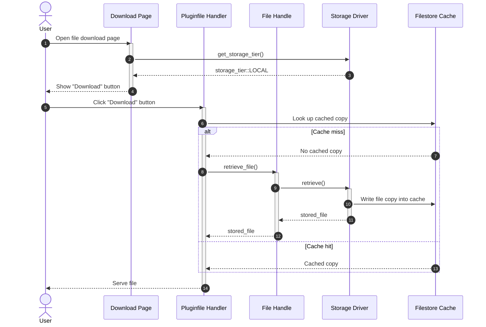
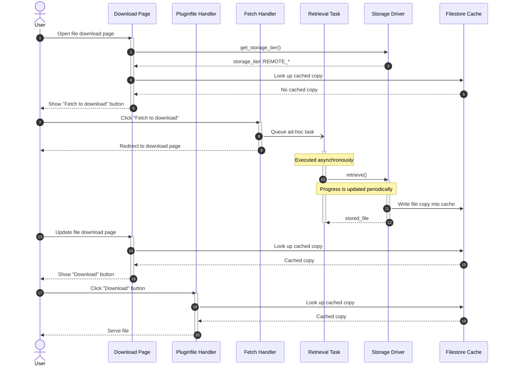

# Storage Drivers

This document defines the interface that [storage driver](../components/storage-drivers.md) implementations must adhere
to.

## Overview

The abstract driver base class for storage drivers is {{ source_file('classes/local/driver/archivingstore.php',
'\\local_archiving\\local\\driver\\archivingstore') }}.

!!! notice "Overview reduced for bravery"
    For bravery, the following overview diagram is reduced to the most important classes and members. Therefore, some
    details like methods, parameters, or members are omitted. Please refer to the {{ source_file('', 'plugin source code') }}
    for a complete reference.

```mermaid
classDiagram
    direction TB

    class archivingstore {
        <<abstract>>
        
        +get_storage_tier()$ storage_tier
        +supports_retrieve()$ bool
        +is_available() bool
        +get_free_bytes() int|null
        +store(jobid: int, file: stored_file, path: string, progresscallback: callable|null) file_handle
        +retrieve(handle: file_handle, fileinfo: stdClass, progresscallback: callable|null) stored_file
        +delete(handle: file_handle, strict: bool) void
    }
    
    class base {
        <<abstract>>
        +ALLOWED_PLUGIN_TYPES: const string[]
            
        +get_frankenstyle_name() stdClass
        +get_plugin_type() string
        +get_plugin_name() string
        +is_ready()$ bool
        +is_enabled() bool
    }
    
    class archivingstore_localdir {
    }

    class archivingstore_moodle {
    }

    class archivingstore_other {
    }
    
    class storage_tier {
        <<enumeration>>
        LOCAL
        REMOTE_FAST
        REMOTE_SLOW
    }
    
    class file_handle {
        +id: int
        +jobid: int
        +archivingstorename: string 
        +deleted: bool
        +filename: string
        +filepath: string
        +filesize: int
        +sha256sum: string
        +mimetype: string
        +timecreated: int
        +timemodified: int
        +filekey: string
        
        +create()$ file_handle
        +destroy(removefile: bool) void
    }

    %% Relationships
    base  <|--  archivingstore
    archivingstore <|-- archivingstore_localdir
    archivingstore <|-- archivingstore_moodle
    archivingstore <|-- archivingstore_other
    storage_tier -- archivingstore
    file_handle -- archivingstore
    
    %% style
    style storage_tier fill:#dedede,stroke:#666666
    style file_handle fill:#dedede,stroke:#666666
```

## Implementation

Each storage driver must implement the {{ source_file('classes/local/driver/archivingstore.php',
'\\local_archiving\\local\\driver\\archivingstore') }} interface with a class, placed at the following location:
`/local/archiving/local/driver/store/<pluginname>/classes/archivingstore.php`, where `<pluginname>` is the name of the
storage driver (e.g., `localdir`, `moodle`, ...).

Storage is classified into different tiers ({{ source_file ('classes/local/type/storage_tier.php',
'\\local_archiving\\local\\type\\storage_tier') }}), which differentiate between local storage that is directly
accessible and remote storage that is either fast or slow. If a storage type does only support writing data but not
retrieving it, a storage driver can indicate this via the `supports_retrieve()` method.

Once a storage driver is initiated, it reports whether it is currently available for use via the `is_available()`
method. If supported, the number of free bytes within the storage are reported by the `get_free_bytes()` method.

Storing a new file via the `store()` method, requires the source file to be present within the Moodledata storage as an
instance of `\stored_file`. For every file, a {{ source_file ('classes/file_handle.php',
'\\local_archiving\\file_handle') }} object is created that holds all relevant metadata to identify the referenced file
in the target storage system. To retrieve a previously stored file, the `retrieve()` method takes the information from
the `file_handle` and tries to load a copy of the referenced file into the Moodledata storage, according to the given
`$fileinfo` record. This standard Moodledata file record will be generated by the [archiving
manager](../components/archiving-manager.md) and simply passed to the storage driver. Never must a storage driver
generate its own file record.

If supported, existing files can be remove from the storage system via the `delete()` method. If working with previously
stored files, make sure to also destroy the corresponding `file_handle` object. It is recommended to access referenced
conveniently via the `file_handle` API instead of interfacing the underlying storage driver directly.

## Accessing stored files via the Moodle UI

If a storage driver supports retrieving files, as indicated by the `supports_retrieve()` method, the Moodle UI will
automatically offer a button to access the stored archive file via the archive job file listing page. Whenever a file is
accessed, it is transparently cached inside a designated Moodle filearea (see {{ source_file('classes/file_handle.
php', '\\local_archiving\\file_handle::retrieve_file()') }}). The file is then served to the user via the standard
Moodle file serving mechanism. This allows archive files to be served in a common way, regardless of the underlying
storage driver.

!!! info "File cache cleanup"
    The file cache is automatically cleaned by `\local_archiving\task\cleanup_file_cache`. All cached copies that
    haven't been accessed for at least 24 hours are removed from the cache.

### Retrieving files from local storages

As local files are rapidly accessible, they are synchronously cached and served directly to the user at the time of the
request. Access is thereby nearly instant. This applies to all storage drivers that identify themselves as
`\storage_tier::LOCAL`.

The following sequence diagram illustrates the synchronous retrieval and caching of files stored in a `LOCAL` tier
storage.

```mermaid
sequenceDiagram
    autonumber
    actor User
    participant UI as Download Page
    participant PF as Pluginfile Handler
    participant FH as File Handle
    participant SD as Storage Driver
    participant FC as Filestore Cache

    %% File listing
    User ->> UI: Open file download page
    activate UI
    UI ->> SD: get_storage_tier()
    SD -->> UI: storage_tier::LOCAL
    UI -->> User: Show "Download" button
    deactivate UI

    %% Download request
    User ->> PF: Click "Download" button
    activate PF
    PF ->> FC: Look up cached copy
    alt Cache miss
        FC -->> PF: No cached copy
        PF ->> FH: retrieve_file()
        activate FH
        FH ->> SD: retrieve()
        activate SD
        SD ->> FC: Write file copy into cache
        SD -->> FH: stored_file
        deactivate SD
        FH -->> PF: stored_file
        deactivate FH
    else Cache hit
        FC -->> PF: Cached copy
    end
    PF -->> User: Serve file
    deactivate PF
```

### Retrieving files from remote storages

If a file is stored in a remote storage, it must be fetched before it can be served to the user. This applies to all
storage drivers that identify themselves as `\storage_tier::REMOTE_*`. If a file is not yet cached, users will see a
{{ mform_element('Fetch to download', 'button') }} button on the archive job file listing page. Clicking this button
will spawn a background task that asynchronously fetches the file into the file cache (see
{{ source_file ('classes/task/retrieve_remote_file.php', '\local_archiving\task\retrieve_remote_file') }}). Once
available, users will see a {{ mform_element ('Download', 'button') }} button to download the file. The progress and
potential errors are [periodically reported](#progress-reporting-and-cancellation) to the user while a fetch operation
is running.

The following sequence diagram illustrates the asynchronous retrieval and caching of files stored in a `REMOTE_*` tier
storage.

```mermaid
sequenceDiagram
    autonumber
    actor User
    participant UI as Download Page
    participant PF as Pluginfile Handler
    participant FE as Fetch Handler
    participant RT as Retrieval Task
    participant SD as Storage Driver
    participant FC as Filestore Cache

    %% File listing
    User ->> UI: Open file download page
    activate UI
    UI ->> SD: get_storage_tier()
    SD -->> UI: storage_tier::REMOTE_*
    UI ->> FC: Look up cached copy
    FC -->> UI: No cached copy
    UI -->> User: Show "Fetch to download" button
    deactivate UI

    %% Fetch request
    User ->> FE: Click "Fetch to download"
    activate FE
    FE -) RT: Queue ad-hoc task
    FE -->> User: Redirect to download page
    deactivate FE

    %% Asynchronous retrieval
    activate RT
    Note over RT: Executed asynchronously
    RT ->> SD: retrieve()
    activate SD
    Note over RT,SD: Progress is updated periodically
    SD ->> FC: Write file copy into cache
    SD -->> RT: stored_file
    deactivate SD
    deactivate RT

    %% Download request
    User ->> UI: Update file download page
    activate UI
    UI ->> FC: Look up cached copy
    FC -->> UI: Cached copy
    UI -->> User: Show "Download" button
    deactivate UI
    User ->> PF: Click "Download" button
    activate PF
    PF ->> FC: Look up cached copy
    FC -->> PF: Cached copy
    PF -->> User: Serve file
    deactivate PF
```

## Progress Reporting and Cancellation

Both `store()` and `retrieve()` accept an optional `$progresscallback`, which is invoked
periodically as data is transferred, receiving the number of bytes transferred so far and the
total number of bytes to transfer.

The callback may throw a {{ source_file('classes/local/exception/storage_exception.php',
'\\local_archiving\\local\\exception\\storage_exception') }} at any point to request cancellation
of the in-progress transfer. Storage drivers must catch this exception, abort the transfer,
perform any necessary cleanup (e.g., removing partially written local or remote data), and then
re-throw the *same* exception unchanged so it propagates to the caller. A driver must never
swallow the exception or replace it with a different one, since callers may rely on inspecting
the original exception (e.g., its `errorcode`) to distinguish a deliberate cancellation from a
genuine transfer failure.

Storage drivers whose transfers are effectively instant (e.g., `LOCAL` tier drivers writing
directly to Moodledata storage) may ignore `$progresscallback` entirely, since there is no
meaningful transfer to report progress for or cancel.
