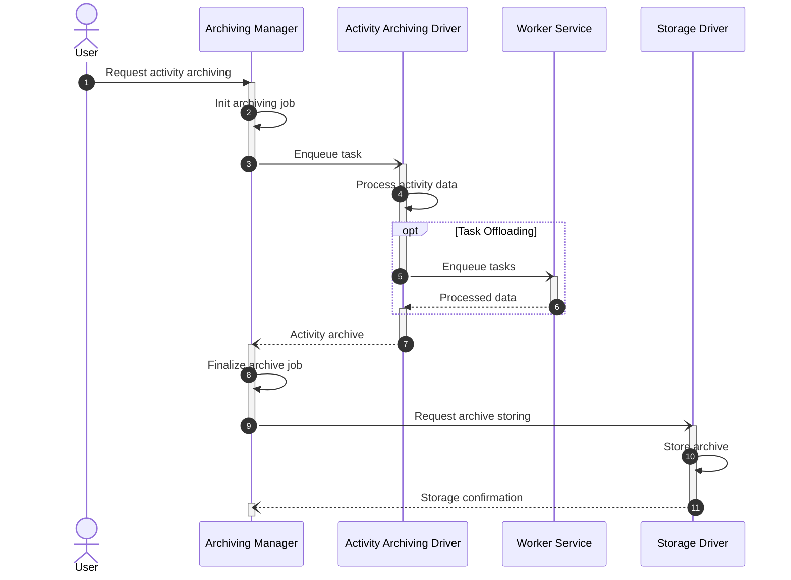
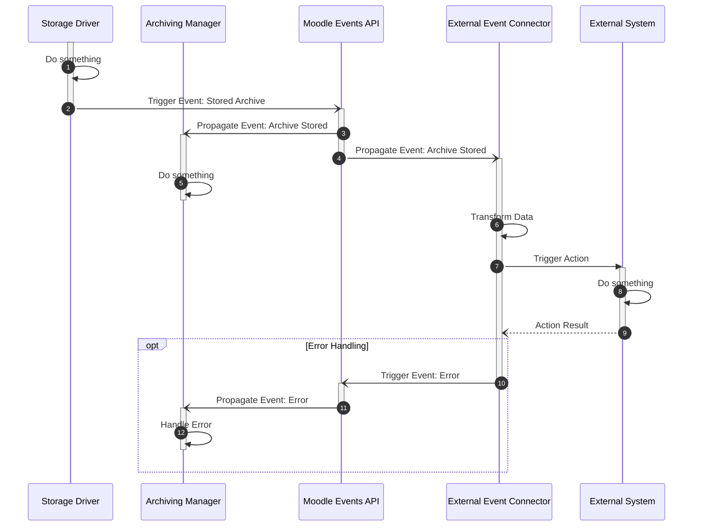

# Archiving Manager

The archiving manager is the central entry point for archiving tasks.

!!! warning "Work in Progress (WIP)"
    This section is still under active development. Information and specifications can still be changed in the future.

## Tasks and Responsibilities

!!! abstract "Course Archiving Overview"
    Providing an overview of archivable data inside each course and whether it has already been archived or not 

!!! abstract "Global Archiving Overview"
    Providing a global overview of archivable data across all courses. Also provides an overview of connected storage
    systems and their status.

!!! abstract "Archive Job Handling"
    Managing archiving tasks as distinct jobs

    - Create, inspect, delete archiving jobs
    - Delegates archiving of activity data to the respective [Activity Archiving Drivers](activity-archiving-drivers.md)
    - Displays progress and status of archiving jobs
    - Handling of multiple archiving jobs in parallel

!!! abstract "Common Post-Processing"
    Handling common post-processing steps for archived data

    - Requesting of digital signatures using TSP

!!! abstract "Automation"
    Automation of archiving tasks

    - Initiating archive jobs periodically or on specific signals
    - Selection of criteria for automated archiving (e.g., course categories, activity types, activity status, ...)
    - Sending of error notifications if automated archiving jobs failed

!!! abstract "Auto-deletion / GDPR Compliance"
    Management of auto-deletion of archived data after a certain retention time (GDPR compliance)

    - Keeping track of retention times for archived data
    - Initiating deletion of archived data after retention time has passed 
    
    Handling of GDPR requests for retrieval of personal data

!!! abstract "Archive File Handling"
    Forwarding finalized archives to storage drivers

!!! abstract "Global Defaults and Policies"
    Management of global defaults and policies for archiving data

    - Filename patterns, archive formats, retention time, ...
    - Enabling / disabling of archiving for course categories

## Interfaced Components

- [Activity Archiving Drivers](activity-archiving-drivers.md)
- [Storage Drivers](storage-drivers.md)

## Details

### Archive Job Flow

The following sequence diagram illustrated the basic information flow of a successful archiving job.

### External Event Connector Integration

The following sequence diagram illustrates the way external event connectors integrate into the archiving system. We use
the event triggered after a new archive has been stored successfully as an example.

