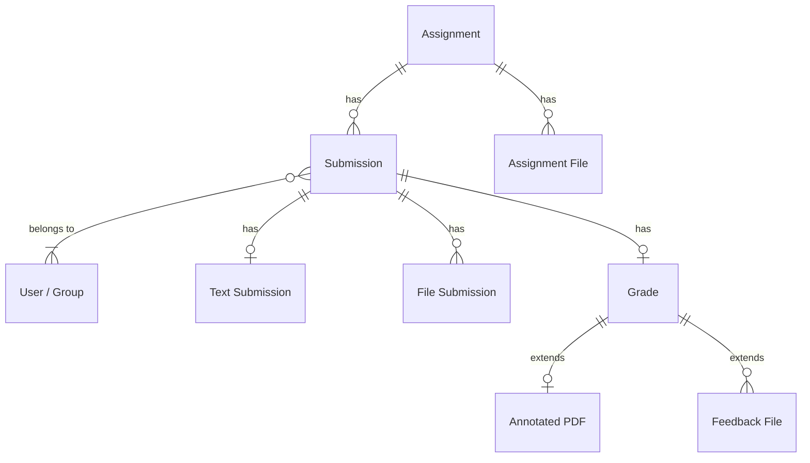
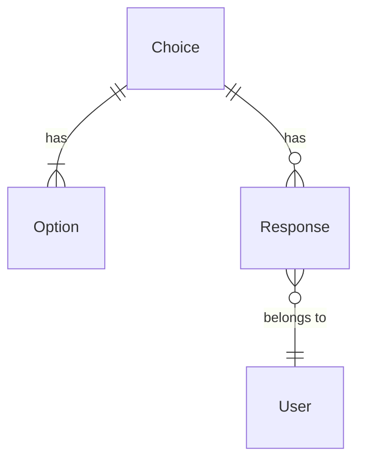
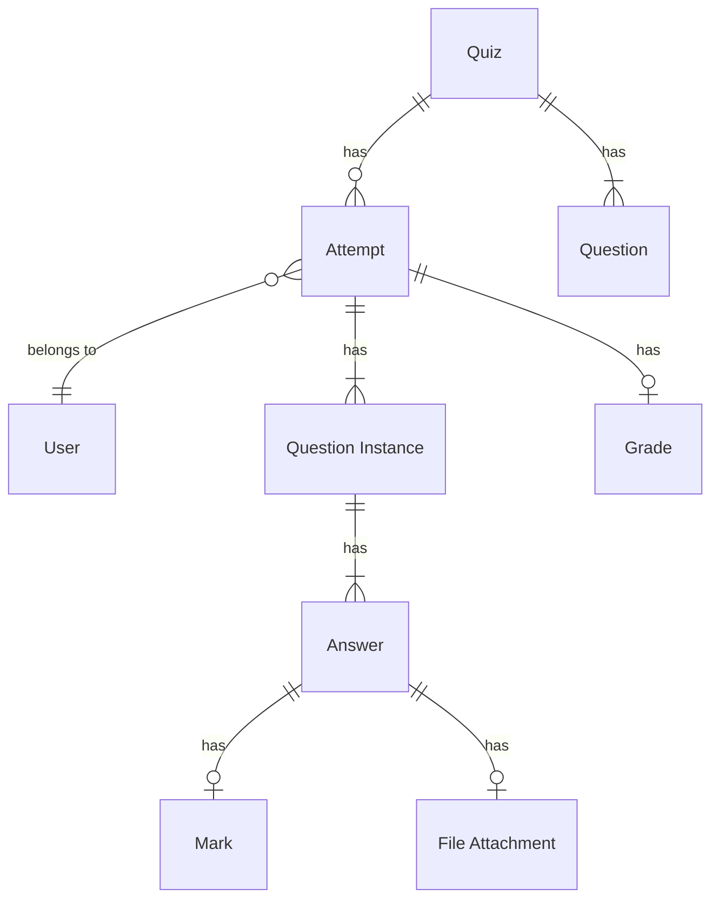
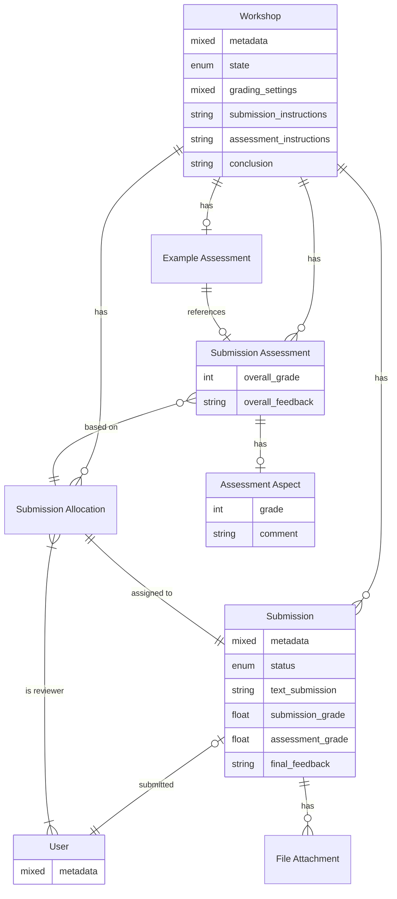

# Data Analysis

This section describes different types of archivable data that can be present inside a Moodle course, primarily within
the context of a Moodle activity. Identified types of data are briefly described, along with their structure and size.

## Activity: Assignment

Assignments allow students to submit work to their teacher for grading. The work may be a text typed online or uploaded
files of any type. Having both a written text response and a file submission simultaneously is also possible.

Besides a rich-HTML question text, teachers can include additional / template files for students to download. The
provided assignment files are identical for all students that submit their work.

Grading may be by simple percentages or custom scales, or more complex rubrics may be used. Students may submit as
individuals or in groups. Feedback can be given in form of any combination of the following: text feedback,
annotated PDF, teacher-uploaded grading worksheets[^1], or feedback files uploaded by the teacher.

If the assignment requires uploading PDF files, the teacher can annotate the PDFs directly within Moodle. Moodle
automatically generates the annotated PDF files and saves them to be downloaded by teachers and students.

!!! info "Official Documentation"
    For more information on the Assignment activity see
    [Moodle Docs: Assignment activity](https://docs.moodle.org/en/Assignment_activity)

[^1]: Grading worksheets are CSV files that can be downloaded, filled out, and uploaded back to Moodle. The assigned
grades and feedback texts are simply imported into the Moodle activity. The grading worksheet is discarded afterwards,
hence requires no special handling during archiving.

### Data Structure

- Assignment activity
    - Assignment metadata (title, description, ...)
    - Assignment instructions
    - Assignment files (additional / template files for students to download)
    - Submissions
        - Submission metadata (user, submission time, ...)
        - Submission status (not submitted, submitted for grading, graded, ...)
        - User metadata (id, name, email, matriculation number, ...)
        - Group metadata (users inside the group)
        - Text submissions
        - File submissions (any type, often PDF)
        - Submission comments
        - Feedback comments
        - Grade
        - Annotated PDF files
        - Feedback files

##### High-level overview of central data relationships in the Assignment activity

## Activity: Choice

The Choice activity allows you to ask a question and set up radio buttons which learners can click to make a selection
from a number of possible responses. They can choose one or more options, depending on the activity settings. Choices
can be useful as quick poll to stimulate thinking about a topic, to allow the class to vote on a direction
for the course, or to lock decision about personal topic focus.

It is possible to allow students to update their prior to a given date and time. Results can optionally be published
alongside all students. 

!!! info "Official Documentation"
    For more information on the Choice activity see
    [Moodle Docs: Choice activity](https://docs.moodle.org/en/Choice_activity)

### Data Structure

- Choice activity 
    - Choice metadata (title, description, ...)
    - Options (possible responses)
    - Choices / responses
        - User metadata (id, name, email, matriculation number, ...)
        - Selected option
        - Response date and time[^3]

[^3]: The response date and time is the time when the user submitted their choice. This data is not exposed via the
Moodle UI but can be retrieved from the database.

##### High-level overview of central data relationships in the Choice activity

## Activity: Quiz

The Quiz is a very powerful activity that can meet many teaching needs, from simple, multiple-choice knowledge tests to
complex, self-assessment tasks with detailed feedback. It is one of the two most frequently used Moodle activities for
assessing students, the other being the [Assignment activity](#activity-assignment).

Each Quiz consists of a set of questions. These questions can be of different types, such as multiple-choice, true/false,
short answer, essay, and more. Students can take the quiz and submit their answers. Every time a student attempts a quiz,
a new quiz attempt is created. The Quiz activity can be configured to allow multiple attempts, with each attempt being
graded automatically or manually by the teacher. The Quiz activity can also be configured to provide feedback to the
student after each attempt, and to show the correct answers after the quiz is closed.

!!! info "Official Documentation"
    For more information on the Quiz activity see
    [Moodle Docs: Quiz activity](https://docs.moodle.org/en/Quiz_activity)

### Data Structure

- Quiz activity
    - Quiz metadata (title, description, ...)
    - Questions
    - Attempts
        - Attempt metadata (user, start time, end time, ...)
        - Attempt status
        - User metadata (id, name, email, matriculation number, ...)
        - Questions (question text, answer options, ...)
        - Question answer file attachments [^2]
        - Answers
        - Response history
        - Feedback
            - General question feedback
            - Individual question feedback
            - Overall attempt feedback
        - Question marks
        - Manual question mark overrides and teacher comments
        - Attempt grade (summative)

[^2]: Only applies to essay questions when considering Moodle core question types. Might apply to other third party
question types.

##### High-level overview of central data relationships in the Quiz activity

## Activity: Workshop

The Workshop activity is a powerful peer assessment activity. Students add submissions which are then distributed
amongst their peers for assessment based on a grading scale specified by the teacher. Students can submit their work as
text (online editor), uploaded files, or both. The teacher can provide further text based submission instructions.

Each workshop goes through five phases:

  1. **Setup phase**: The teacher sets up the workshop, defines the grading scale, and sets the submission deadline.
  2. **Submission phase**: Students submit their work and are assigned submissions to assess.
  3. **Assessment phase**: Students assess the submissions assigned to them.
  4. **Grading evaluation phase**: The teacher reviews the assessments and can provide feedback and override grades.
  5. **Closed**: The teacher releases the grades and feedback to the students. Grades are final at this point and ready 
     to be archived[^4].

Submissions are graded by one or more students, as assigned either manually by the teacher or randomly. Students receive
two grades: one for their submission and one for their assessment (peer review). The teacher can choose independent
grading scales for both grades. Students can either enter a grade and a reason or answer a number of yes / no questions
provided by the teacher via the assessment form. After the assessment phase, teachers can review the assessment and
provide feedback and override the grades if necessary.

After the teacher reviewed all assessments, the teacher can provide a final conclusion and release the grades and
feedback to the students. Once this is done, the workshop is considered closed and grades are final.

!!! info "Official Documentation"
    For more information on the Workshop activity see
    [Moodle Docs: Workshop activity](https://docs.moodle.org/en/Workshop_activity)

[^4]: Only workshops in the "Closed" state are considered applicable for archiving. Workshops in other states should
      never be archived, as submissions and grades may still be subject to changes.

### Data Structure

- Workshop activity
    - Workshop metadata (title, description, ...)
    - Workshop state / phase (see above)
    - Garding settings (grading strategy, grading weights)
    - Submission instructions
    - Assessment instructions
    - Workshop conclusion (global teacher feedback)
    - Example submissions / assessment examples
    - Submissions
        - Submission metadata (user, submission time, ...)
        - Submission status (not submitted, submitted)
        - User metadata (id, name, email, matriculation number, ...)
        - Text submissions
        - File submissions
        - Grade for submission
        - Grade for assessment
        - Final feedback
    - Submissions allocation
        - Submission metadata
        - Reviewer user(s) metadata
    - Submission assessment
        - Submission metadata
        - Reviewer user metadata
        - Assessment aspects
            - Aspect grade
            - Aspect comment
        - Overall grade
        - Overall feedback

##### High-level overview of central data relationships in the Workshop activity

## Course Completion and Grades

Moodle provides a feature to track activity completion and assign grades on a course level.

Course completion shows if a course has been completed by a given student. It can show the progress a student is making
towards finishing the course according to specific criteria. The criteria can include meeting an activity's grade level
or a manual checking "complete" by either the student and/or teacher. The report can also show if the student has
completed another course(s) that is marked as a "completion dependent" course.

Every course has its own Gradebook which aggregates grades from all gradable activities in the course, allowing the
teacher to calculate an overall grade for the course.

!!! info "Official Documentation"
    For more information on Course completion and Grades in Moodle see
    [Moodle Docs: Course completion](https://docs.moodle.org/en/Course_completion) and
    [Moodle Docs: Grades](https://docs.moodle.org/en/Grades)

Since the course completion and gradebook data are aggregates of the data from the activities, they are not considered
archivable data themselves. Instead, the data from the activities should be archived directly for now.
