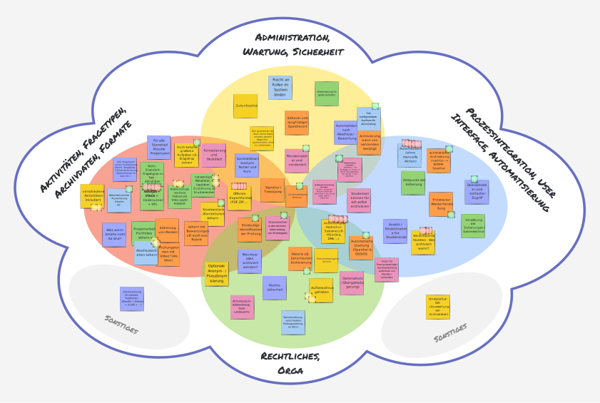

# Roadmap

This page outlines the planned steps and milestones for the development of the aspired Moodle Data Archiving Solution.
Listed milestones possess a certain order but are not guaranteed to be completed in the exact order listed below.

### Legend

The state of each Milestone is depicted by the respective icon and color:

!!! success "Completed"
!!! example "Testing / Finalizing"
!!! note "In progress"
!!! abstract "Not started yet"

### Milestones

!!! success "Analysis of existing solutions"
    Finding and inspecting existing solutions for extracting data from Moodle activities used for e-assessments.
    Identifying core features and limitations of each solution to gain insight into the current landscape.

    This task is completed. Results can be found here: [Analysis > Existing Solutions](dev/requirements/existing-solutions.md)

    [:material-package-variant-closed: Show Results](dev/requirements/existing-solutions.md){.md-button}

!!! success "Analysis of core Moodle activities available for e-assessments"
    Identifying all Moodle core activities that can be used for e-assessments and therefore should potentially be
    supported by the aspired archiving solution. For each activity, the data that it stores is analyzed. This includes
    listing all relevant user data points, metadata, file submissions, and other relevant information. Moreover, the
    structure of the existing data and how it relates to other data of the activity is analyzed.
    
    This task is completed. Results can be found here: [Analysis > Data Analysis](dev/requirements/data-analysis.md)

    [:material-package-variant-closed: Show Results](dev/requirements/data-analysis.md){.md-button}

!!! success "Stakeholder workshop"
    Conducting a workshop with stakeholders / universities in Germany, Switzerland, and Austria to gather requirements
    for the aspired archiving solution. Identify both general requirements, as well as institution-specific needs and
    weigh them by their perceived relevance. Create a digest of the workshop results and use them as a basis for the
    requirements engineering phase.

    This task is completed. Results can be found here:

    

        <figure markdown="span" style="max-width: 256px; display: inline-block;">
            { loading=lazy }
            <figcaption>
                Keyword Clustering (German) 
                <a href="../assets/artifacts/2024/20241127_Moodle_Archiving_Workshop_Stichwort_Cluster.pdf" target="_blank">[Download as PDF]</a>
            </figcaption>
        </figure>
        &nbsp;&nbsp;&nbsp;
        <figure markdown="span" style="max-width: 215px; display: inline-block;">
            { loading=lazy }
            <figcaption>
                Identified Use Cases (German) 
                <a href="../assets/artifacts/2024/20241127_Moodle_Archiving_Workshop_Use_Cases.pdf" target="_blank">[Download as PDF]</a>
            </figcaption> 
        </figure>
         
        _Perceived demand is indicated by the amount of dots on each card_
    

!!! success "Formulation of user stories"
    Formulating concrete user stories in a structured fashion to highlight the expectations on the aspired archiving
    solution from various perspectives. Rating of every user story based on the perceived relevance / demand.

    User stories are based on the results of the stakeholder workshop, inputs from multiple conference talks / sessions
    about archiving of Moodle quizzes, and results from personal interviews with members of the Moodle community.

    This task is completed. Results can be found here: [Requirements > User Stories](dev/requirements/user-stories.md)

    [:material-package-variant-closed: Show Results](dev/requirements/user-stories.md){.md-button}

!!! success "Definition of base requirements for archiving exam data from Moodle"
    Defining hard base requirements that the aspired archiving solution must fulfill from a technical, functional and
    legal point of view. These requirements are independent of the actual Moodle activity itself but target general
    topics like data integrity, traceability, compatibility, regulatory topics, and privacy.

    This task is completed. Results can be found here: [Requirements > Base Requirements](dev/requirements/base-requirements.md)

    [:material-package-variant-closed: Show Results](dev/requirements/base-requirements.md){.md-button}

!!! success "First technical architecture draft"
    Creating a first draft of a possible technical architecture for the aspired archiving solution. Defining core
    components, interfaces, process states, and information flow. Forming proper abstractions and interfaces to allow
    flexible embedding in university infrastructures. Defining core implementation philosophies and principles.

    This task is completed. Results can be found here: [Architecture](dev/index.md)

    [:material-package-variant-closed: Show Results](dev/index.md){.md-button}

!!! success "Public availability of this document and project sources"
    Making this document and the project sources publicly available on GitHub.

    This task is completed. The public repository can be found here:
    [ngandrass/moodle-data-archiving-concept](https://github.com/ngandrass/moodle-data-archiving-concept)

    [:material-github: View Repository](https://github.com/ngandrass/moodle-data-archiving-concept){:target="_blank" .md-button}

!!! success "Presentation within the Moodle community"
    Present this work and the next steps within the Moodle community to get the news out, gather feedback, and
    potentially find early adopters as well as potential contributors.

    This task is completed. The work was presented at the Moodle University Conference 2025 at the University of
    Potsdam, Germany.

    [:material-presentation: Get the slides](https://gandrass.de/#pub-Gandrass2025MAT){.md-button}

!!! success "Prototype implementation"
    Creating a prototypical implementation of the aspired archiving solution for a single Moodle activity. This shall
    include all core components and interfaces as defined in the technical architecture draft. The prototype should be
    limited to a single Moodle activity and a single storage backend.

    This task is completed. The current implementation can be found on GitHub:

    [:material-github: View Repository](https://github.com/ngandrass/moodle-local_archiving){:target="_blank" .md-button}

!!! success "Re-evaluation of the technical architecture"
    Re-evaluating the technical architecture based on the insights gained during the prototype implementation. Adjusting
    the architecture where necessary and refining the interfaces and components.

    This task is completed. You can find the up to date architecture within the [developer documentation](dev/index.md).

    [:material-package-variant-closed: Show Results](dev/index.md){.md-button}

!!! success "Automated tests"
    Creating automated tests for all central components of the archiving solution. Tests must be automatically
    executed by a CI pipeline and be mandatory for every release. Tests must cover all supported Moodle, PHP, and
    database versions to lessen the likelihood for regressions.

    This task is completed. Unit tests for all core features and APIs are implemented. This also extends to all of the
    sub-plugins that are part of the core distribution.

    [:material-code-tags: View Unit Tests](https://github.com/ngandrass/moodle-local_archiving/tree/master/tests){:target="_blank" .md-button}

!!! success "Full implementation of the archiving solution for a single activity"
    Implementing the full set of features for a single Moodle activity. This implementation should represent a reference
    implementation to be used as a guideline for further activities, storage backends, and other extensions.

    This task is completed. Archiving of Moodle quizzes is fully implemented via the `archivingmod_quiz` sub-plugin.

    [:material-github: View Repository](https://github.com/ngandrass/moodle-archivingmod_quiz){:target="_blank" .md-button}

!!! success "Support for automated archive triggers"
    Creating a software architecture and implementations that allow for automated triggering of archive creation. This
    can, for example, be time-base triggering or triggering based on specific events, such as the submission of a new
    quiz attempt.

    This task is completed. The archiving trigger sub-plugin type was created and a time-based trigger implementation
    (`archivingtrigger_cron`) was developed.

    [:material-github: View Repository](https://github.com/ngandrass/moodle-archivingtrigger_cron){:target="_blank" .md-button}

!!! success "Finalizing of sub-plugin APIs"
    Declare APIs for sub-plugins as stable. From this point on, changes to the APIs must be carefully considered, must
    not break existing implementations, and must be well documented.

    This task is completed. The first stable version of all sub-plugin APIs was released with version 1.0.0 of the
    archiving core plugin.

    [:material-package-variant-closed: View Developer Documentation](dev/index.md){.md-button}

!!! success "Stable release on GitHub for early-adopters"
    Publishing a stable release on GitHub to allow early adopters to test the solution in their environments. This shall
    also constitute a base for further feedback and potential contributions.

    This task is completed. The first stable release of the archiving core plugin and a selected set of sub-plugins was
    published on GitHub.

    [:material-github: View Repository](https://github.com/ngandrass/moodle-local_archiving){:target="_blank" .md-button}

!!! success "User and administrator documentation"
    Creating comprehensive documentation for users and administrators of the archiving solution. This documentation
    should cover installation, configuration, usage, and troubleshooting.

    This task is completed. You are currently viewing the user and administrator documentation.

    [:material-book-open-page-variant: View Documentation Index](index.md){.md-button}

!!! abstract "Implementing additional activities, storage backends, ..."
    Implementing support for additional Moodle activities, storage backends, and other customizations.

!!! abstract "Release within the Moodle Plugin Directory"
    Releasing the archiving solution to the wide public via the Moodle Plugin Directory. For this release, the archiving
    system must not only be stable and tested, but also extensive documentation and help resources must be available.

!!! abstract "Ensuring Maintenance"
    Ensuring the maintenance of the archiving solution by creating a sustainable development and support structure. This
    can, apart from creating an open-source community around the project, also include appointing designated maintainers
    and support contacts at different universities.
