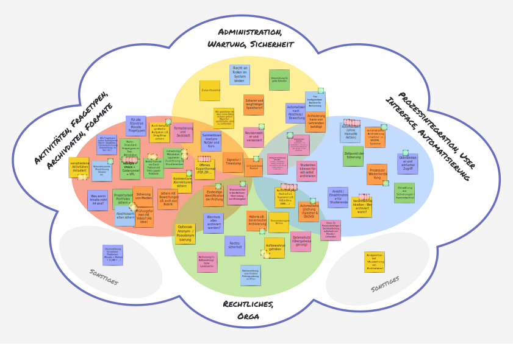
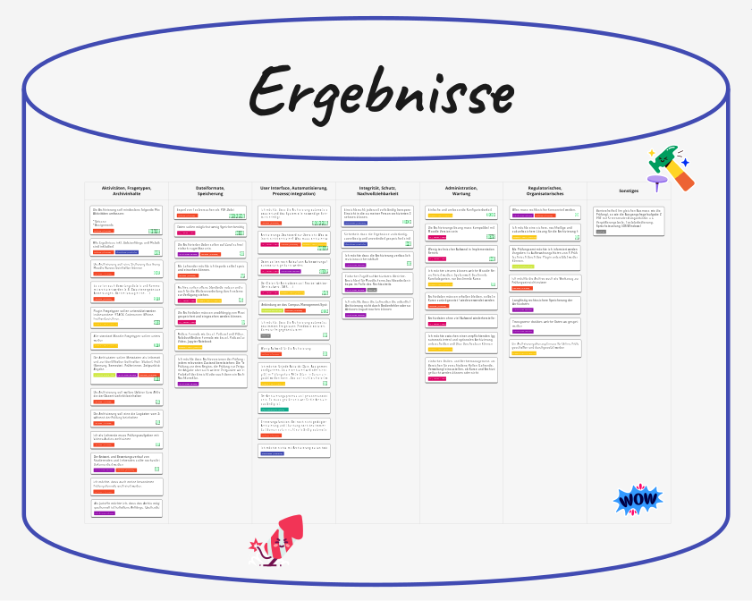

# Roadmap

This page outlines the planned steps and milestones for the development of the aspired Moodle Data Archiving Solution.
Listed milestones possess a certain order but are not guaranteed to be completed in the exact order listed below.

### Legend

The state of each Milestone is depicted by the respective icon and color:

!!! success "Completed"
!!! note "In progress"
!!! abstract "Not started yet"

### Milestones

!!! success "Analysis of existing solutions"
    Finding and inspecting existing solutions for extracting data from Moodle activities used for e-assessments.
    Identifying core features and limitations of each solution to gain insight into the current landscape.

    This task is completed. Results can be found here: [Analysis > Existing Solutions](analysis/existingsolutions.md)

    [:material-package-variant-closed: Show Results](analysis/existingsolutions.md){.md-button}

!!! success "Analysis of core Moodle activities available for e-assessments"
    Identifying all Moodle core activities that can be used for e-assessments and therefore should potentially be
    supported by the aspired archiving solution. For each activity, the data that it stores is analyzed. This includes
    listing all relevant user data points, metadata, file submissions, and other relevant information. Moreover, the
    structure of the existing data and how it relates to other data of the activity is analyzed.
    
    This task is completed. Results can be found here: [Analysis > Data Analysis](analysis/data-analysis.md)

    [:material-package-variant-closed: Show Results](analysis/data-analysis.md){.md-button}

!!! success "Stakeholder workshop"
    Conducting a workshop with stakeholders / universities in Germany, Switzerland, and Austria to gather requirements
    for the aspired archiving solution. Identify both general requirements, as well as institution-specific needs and
    weigh them by their perceived relevance. Create a digest of the workshop results and use them as a basis for the
    requirements engineering phase.

    This task is completed. Results can be found here:

    

        <figure markdown="span" style="max-width: 256px; display: inline-block;">
            { loading=lazy }
            <figcaption>
                Keyword Clustering (German) 
                <a href="../assets/artifacts/2024/20241127_Moodle_Archiving_Workshop_Stichwort_Cluster.pdf" target="_blank">[Download as PDF]</a>
            </figcaption>
        </figure>
        &nbsp;&nbsp;&nbsp;
        <figure markdown="span" style="max-width: 215px; display: inline-block;">
            { loading=lazy }
            <figcaption>
                Identified Use Cases (German) 
                <a href="../assets/artifacts/2024/20241127_Moodle_Archiving_Workshop_Use_Cases.pdf" target="_blank">[Download as PDF]</a>
            </figcaption> 
        </figure>
         
        _Perceived demand is indicated by the amount of dots on each card_
    

!!! success "Formulation of user stories"
    Formulating concrete user stories in a structured fashion to highlight the expectations on the aspired archiving
    solution from various perspectives. Rating of every user story based on the perceived relevance / demand.

    User stories are based on the results of the stakeholder workshop, inputs from multiple conference talks / sessions
    about archiving of Moodle quizzes, and results from personal interviews with members of the Moodle community.

    This task is completed. Results can be found here: [Requirements > User Stories](requirements/user-stories.md)

    [:material-package-variant-closed: Show Results](requirements/user-stories.md){.md-button}

!!! success "Definition of base requirements for archiving exam data from Moodle"
    Defining hard base requirements that the aspired archiving solution must fulfill from a technical, functional and
    legal point of view. These requirements are independent of the actual Moodle activity itself but target general
    topics like data integrity, traceability, compatibility, regulatory topics, and privacy.

    This task is completed. Results can be found here: [Requirements > Base Requirements](requirements/base-requirements.md)

    [:material-package-variant-closed: Show Results](requirements/base-requirements.md){.md-button}

!!! success "First technical architecture draft"
    Creating a first draft of a possible technical architecture for the aspired archiving solution. Defining core
    components, interfaces, process states, and information flow. Forming proper abstractions and interfaces to allow
    flexible embedding in university infrastructures. Defining core implementation philosophies and principles.

    This task is completed. Results can be found here: [Architecture](architecture/index.md)

    [:material-package-variant-closed: Show Results](architecture/index.md){.md-button}

!!! success "Public availability of this document and project sources"
    Making this document and the project sources publicly available on GitHub.

    This task is completed. The public repository can be found here:
    [ngandrass/moodle-data-archiving-concept](https://github.com/ngandrass/moodle-data-archiving-concept)

    [:material-github: View Repository](https://github.com/ngandrass/moodle-data-archiving-concept){:target="_blank" .md-button}

!!! abstract "Presentation within the Moodle community"
    Present this work and the next steps within the Moodle community to get the news out, gather feedback, and
    potentially find early adopters as well as potential contributors.

!!! note "Prototype implementation"
    Creating a prototypical implementation of the aspired archiving solution for a single Moodle activity. This shall
    include all core components and interfaces as defined in the technical architecture draft. The prototype should be
    limited to a single Moodle activity and a single storage backend.

!!! abstract "Re-evaluation of the technical architecture"
    Re-evaluating the technical architecture based on the insights gained during the prototype implementation. Adjusting
    the architecture where necessary and refining the interfaces and components.

!!! abstract "Automated tests"
    Creating automated tests for all central components of the archiving solution. Tests must be automatically
    executed by a CI pipeline and be mandatory for every release. Tests must cover all supported Moodle, PHP, and
    database versions to lessen the likelihood for regressions.

!!! abstract "Full implementation of the archiving solution for a single activity"
    Implementing the full set of features for a single Moodle activity. This implementation should represent a reference
    implementation to be used as a guideline for further activities, storage backends, and other extensions.

!!! abstract "Stable release on GitHub for early-adopters"
    Publishing a stable release on GitHub to allow early adopters to test the solution in their environments. This shall
    also constitute a base for further feedback and potential contributions.

!!! abstract "User and administrator documentation"
    Creating comprehensive documentation for users and administrators of the archiving solution. This documentation
    should cover installation, configuration, usage, and troubleshooting.

!!! abstract "Implementing additional activities, storage backens, ..."
    Implementing support for additional Moodle activities, storage backends, and other customizations.

!!! abstract "Release within the Moodle Plugin Directory"
    Releasing the archiving solution to the wide public via the Moodle Plugin Directory. For this release, the archiving
    system must not only be stable and tested, but also extensive documentation and help resources must be available.

!!! abstract "Ensuring Maintenance"
    Ensuring the maintenance of the archiving solution by creating a sustainable development and support structure. This
    can, apart from creating an open-source community around the project, also include appointing designated maintainers
    and support contacts at different universities.
