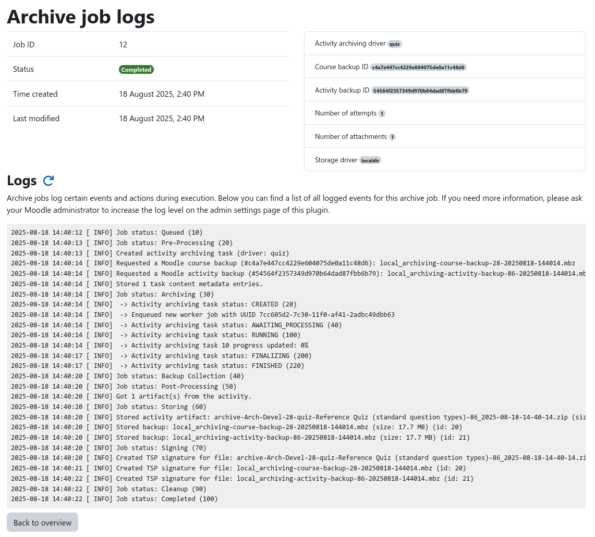
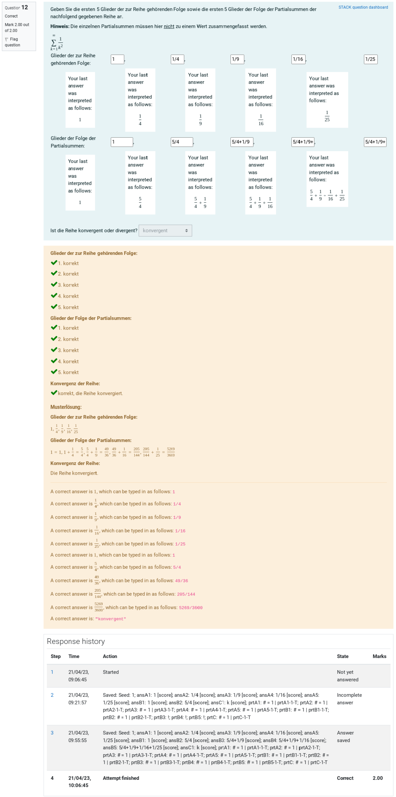
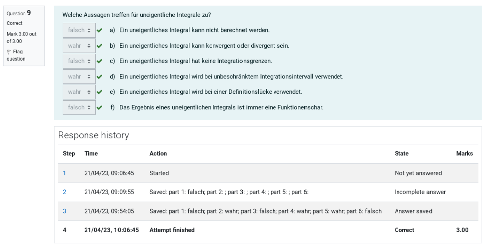
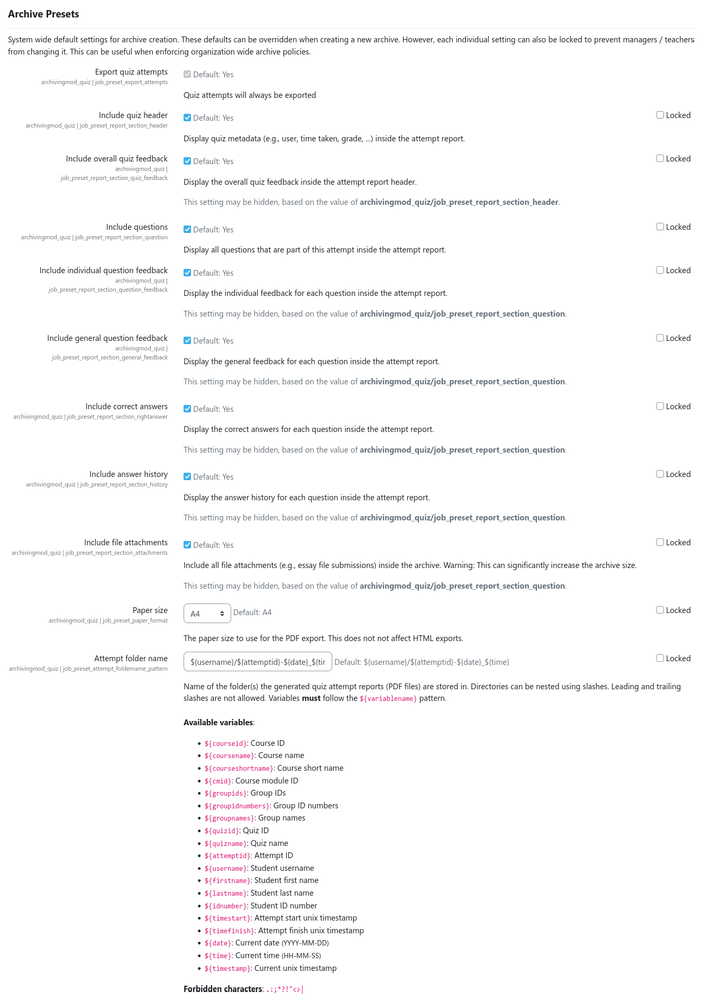

# Screenshots

This page contains various screenshots of the archiving subsystem core as well as examples from the distributed
sub-plugins. The screenshots shown here do not cover the full depth of the plugin's functionality, but they should give
you a good first impression of the plugin and its features.

!!! example "Beta Screenshots"
    The following screenshots are from the current development version of the plugin. They may differ from the final
    stable release and might be outdated. To get the latest impression of the plugin, please install a local test version.

## User interface

This section contains screenshots of the pages that are visible to managers.

### Course archiving overview page

### Creating a new archive

### Downloading archived data

### Inspecting archive job logs

## Archive contents

This section contains example screenshots of archived data.

### Example of PDF report (excerpt)

## Admin interface and settings

This section contains screenshots of the admin interface and some configuration options.

### Manage components

### Common settings

### Quiz archiving presets (excerpt)

