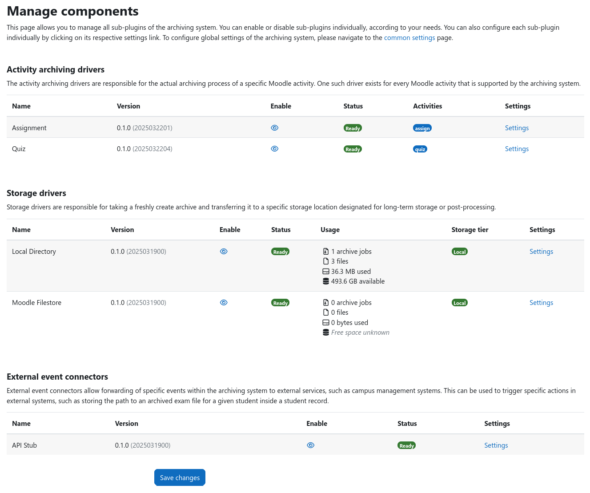

# Manage Components

All currently installed components, i.e., sub-plugins, of the archiving subsystem are listed under {{ moodle_nav_path(
'Site administration', 'Plugins', 'Local plugins', 'Archiving', 'Manage components') }}. This page shows the name, type,
version, and status of each component. It furthermore allows to enable or disable components that support it, provides a
convenient way to access the component-specific settings, and displays further status information, e.g., the space used
by storage drivers.

