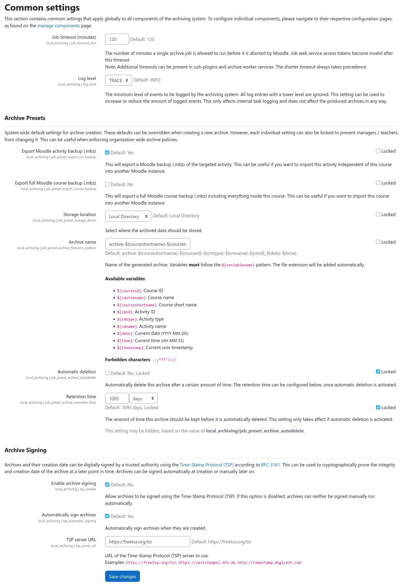

# General Settings

Common settings apply to all parts of the archiving subsystem and can be found under {{ moodle_nav_path('Site
administration', 'Plugins', 'Local plugins', 'Archiving', 'Common settings') }}.

The common settings control how archiving jobs are processed and how the archiving subsystem behaves in general. For
details on each setting, please refer to the inline help texts that are provided for each configuration option.

