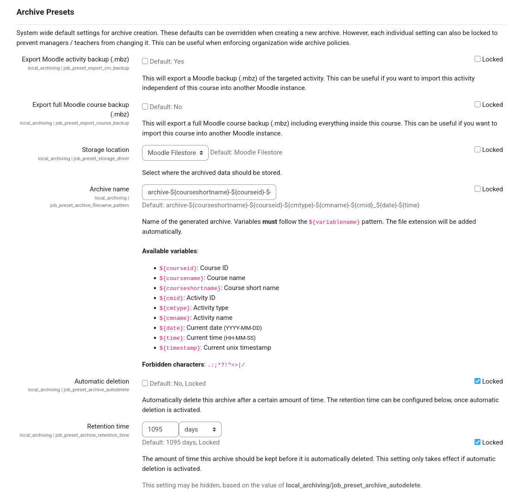

# Job Presets

Default values for all archive job settings can be configured globally on the following admin setting page: 
{{ moodle_nav_path('Site administration', 'Plugins', 'Local plugins', 'Archiving', 'Common settings') }}.

!!! tip
    By default, users are allowed to customize these settings during archive creation. However, each setting can be
    locked individually to prevent users from modifying it during archive creation. This allows the enforcement of
    organization wide policies for archived quizzes.

## Common Archive Job Settings

Settings that are common to all archive jobs, regardless of the targeted activity, can be customized on this page. This
feature can, for example, be used to ensure that a Moodle backup of the targeted activity is always created as part of
any archive job.

## Activity-Specific Archive Job Settings

Any activity archiving driver can extend the common archive job settings by adding further activity-specific settings.
These presets must be configured on the admin setting page of the respective activity archiving driver.

!!! note
    Activity-specific settings differ between activity types and are provided by the respective activity archiving
    drivers. Please refer to the corresponding documentation if needed.

To, for example, customize the presets for archiving quiz activities, navigate to {{ moodle_nav_path('Site
administration', 'Plugins', 'Local plugins', 'Archiving', 'Activity archiving drivers', 'Quiz') }}. There you will find
all quiz-specific settings that can be customized.

