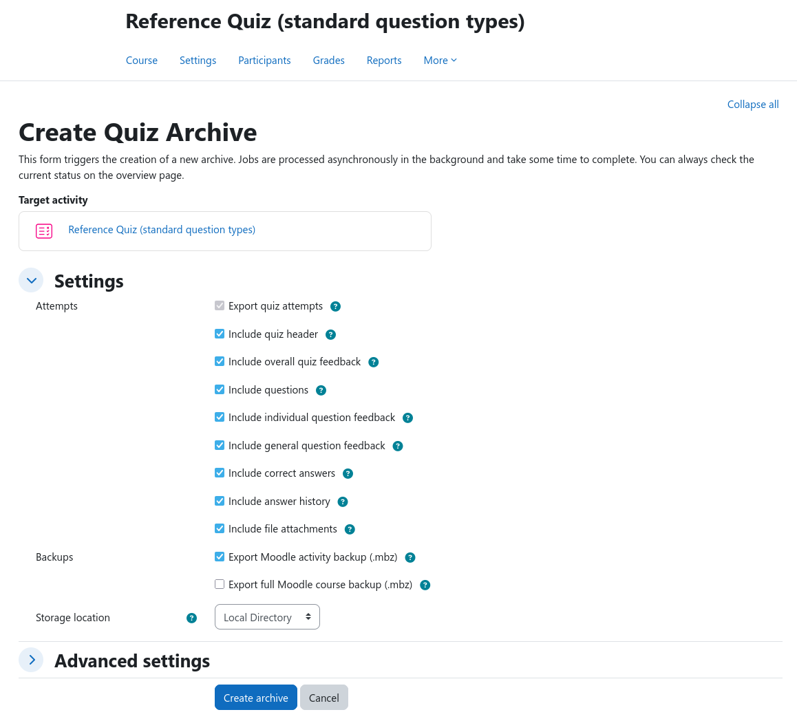

# Archive Creation

The archive creation form can be reached from the [course archiving overview](overview.md) by clicking on the desired
activity or directly from within the activity by clicking on {{ moodle_nav_path('More', 'Archiving') }} inside the
secondary navigation.

The form elements largely depend on the targeted activity type. In the example above, a quiz activity is being archived.
All settings feature a comprehensive help text that explains their effect in detail. It can be accessed by hovering over
the question mark symbol next to each setting.

To create the archiving job, click the _Create archive_ button at the bottom of the form. You should now see a
confirmation message and a newly created job in the table at the bottom of the page. You can monitor the progress of the
archive job by clicking on the refresh button in the top right corner of the table or by navigating to the job logs page
of the respective archive job.

If you wish to select another activity, use the _Cancel_ button to return to the archiving overview without creating a
new job.

!!! info "Locked settings"
    Some settings might be locked by the administrator to enforce organization-wide policies. Locked settings are
    indicated by a greyed-out appearance and can not be changed by the user.

## Advanced Settings

When creating any new activity archive, the _Advanced settings_ section contains options for naming the the archive
itself as well as defining its file structure layout:

- **Archive name** controls the name of the final archive file.
- **Flatten archive** determines the file structure layout of contained artifacts.

Patterns may contain plain text and variables. Variables must use the `${variablename}` syntax. The file extension is
added automatically to the _Archive name_; do not add an extension yourself.

### Available variables

The following table lists all variables available to the naming options. Avariable is only expanded when it is supported
by the selected option.

| Variable             | Description                        |
|----------------------|------------------------------------|
| `${courseid}`        | Course ID                          |
| `${coursename}`      | Course name                        |
| `${courseshortname}` | Course short name                  |
| `${cmid}`            | Course module ID                   |
| `${cmtype}`          | Activity type                      |
| `${cmname}`          | Activity name                      |
| `${date}`            | Current date (`YYYY-MM-DD`)        |
| `${time}`            | Current time (`HH-MM-SS`)          |
| `${timestamp}`       | Current Unix timestamp             |

!!! info
    This list may not be exhaustive. Please check the help text of the respective option in Moodle itself. It will
    always contain an up-to-date list of all variables that your current plugin version supports.

### Naming rules

The following characters are forbidden for generated archive names:
`.`, `:`, `;`, `*`, `?`, `!`, `"`, `<`, `>`, `|`, and `/`.

One example of an archive might be `${cmname}-archive-${courseshortname}-${date}` which results in an archive with the
file name `quiz-archive-MATH101-2026-08-07.zip`.

### File structure

The _Flatten export archive_ checkbox determines how files are organized inside the resulting archive:

- When it is **not selected**, the archive uses a hierarchical structure with separate directories for the different
  artifact types and reports.
- When it is **selected**, the archive uses a flat structure. All files are placed directly in the root of the archive.
  Prefixes are added to file names to distinguish different kind of artifacts and to prevent name collisions.
