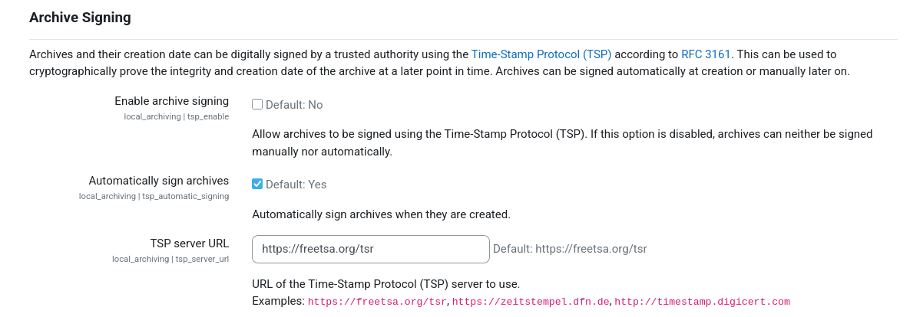
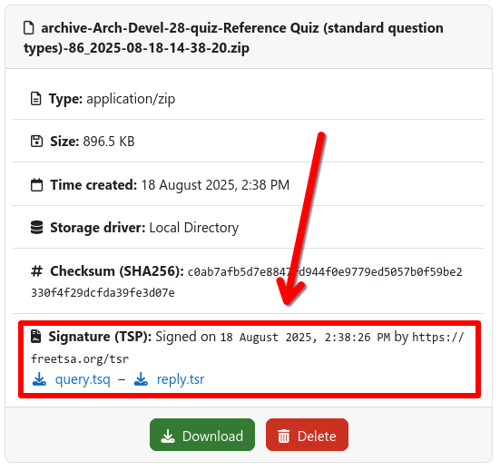

# Archive Signing (TSP)

Archives and their creation date can be digitally signed by a trusted authority using
the [Time-Stamp Protocol (TSP)](https://en.wikipedia.org/wiki/Time_stamp_protocol) according
to [RFC 3161](https://www.ietf.org/rfc/rfc3161.txt). This can be used to cryptographically prove the integrity and
creation date of the archive at a later point in time. Archives can be signed automatically during creation.

## Enabling Archive Signing

Prior to the first use of the archive signing function, the TSP service must be set up once within the plugin settings.
To do so, a Moodle administrator has to follow these steps:

1. Navigate to {{ moodle_nav_path('Site Administration', 'Plugins', 'Local plugins', 'Archiving', 'Common settings') }}
2. Set `tsp_server_url` to the URL of your desired TSP service
3. Globally enable archive signing by checking `tsp_enable`
4. Enable automatic archive signing by checking `tsp_automatic_signing`
5. Save all settings

{ .img-thumbnail }

## Accessing TSP Data

If enabled as described above, new archives will be automatically signed during creation. The generated TSP signatures
can then be accessed via the [artifact download page](download.md) of the respective archive job. This includes both the
TSP query (`.tsq`) that was sent to the TSP service as well as the TSP response (`.tsr`) that contains the actual
signature.

## Validating an Archive and Signature

To validate an archive and its signature, install `openssl` and conduct the following steps:

1. Obtain the certificate files from your TSP authority (`.crt` and `.pem`)[^1]
2. Download the archive and both TSP files (`.tsq` and `.tsr`)
3. Inspect the TSP response to see the timestamp and signed hash value
    1. Execute: `openssl ts -reply -in reply.tsr -text`
4. Verify the archive (`<archive>.zip`) against the TSP response (`reply.tsr`). This process confirms that the archive
   was signed by the TSP authority and that the archive was not modified after signing, i.e., the hash values of the
   file matches the TSP response.
    1. Execute: `openssl ts -verify -in <archive>.tsr -data <archive>.zip -CAfile <tsa>.pem -untrusted <tsa>.crt`
    2. Verify that the output is `Verification: OK` 
       Errors are indicated by `Verification: FAILED`
5. (Optional) Verify that TSP request and TSP response match
    1. Execute: `openssl ts -verify -in <archive>.tsr -queryfile <archive>.tsq -CAfile <tsa>.pem -untrusted <tsa>.crt`
    2. Verify that the output is `Verification: OK` 
       Errors are indicated by `Verification: FAILED`

[^1]: The certificate must be given by your TSP authority. You can usually find it on the website of the service.
