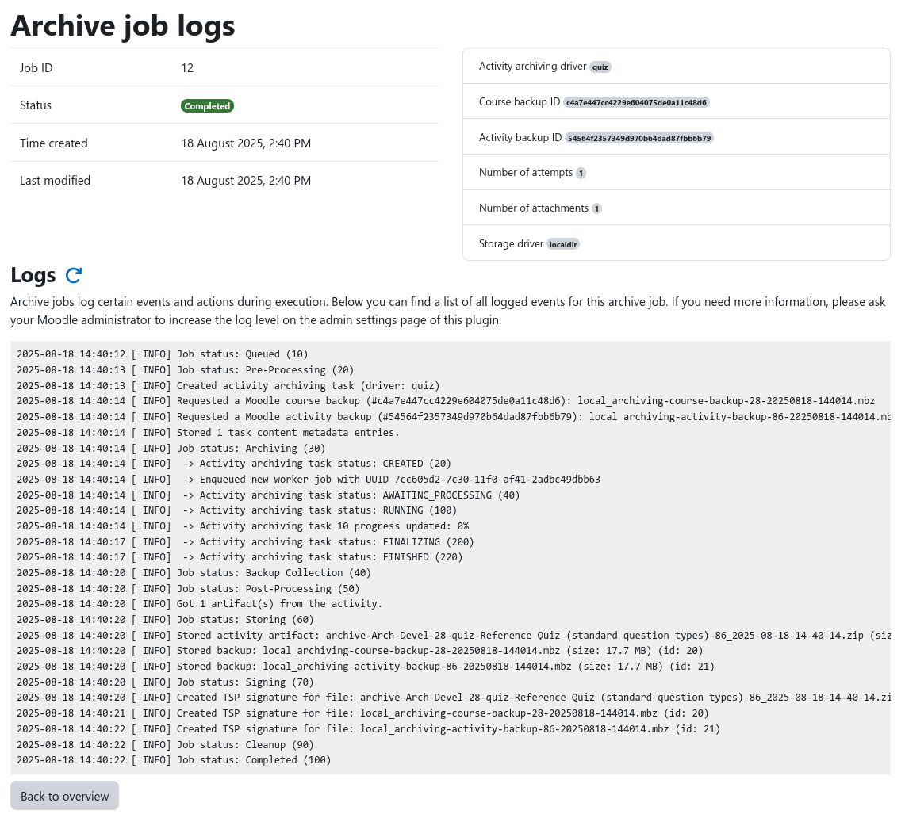

# Inspecting Job Logs

During execution, an archive job generates detailed log messages that provide insights into the current progress of the
archive job, what data was being processed, and allow to understand problems if they occur.

The job logs can be accessed from the [course archiving overview](overview.md) by clicking on the _Logs_ button of the
desired archive job. This brings you to the job logs page that displays various metadata about the job and all logged
messages.

!!! info "Increasing the log level"
    By default, only a small number of events are logged. This is sufficient for normal operation. However, if you
    encounter problems, ask your Moodle administrator to increase the job log level inside the [plugin settings](../setup/config/general.md)
    and re-run the job to gain more insight.

