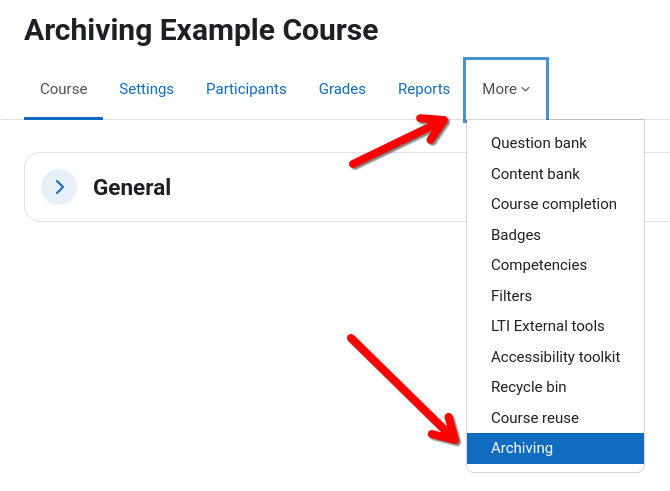
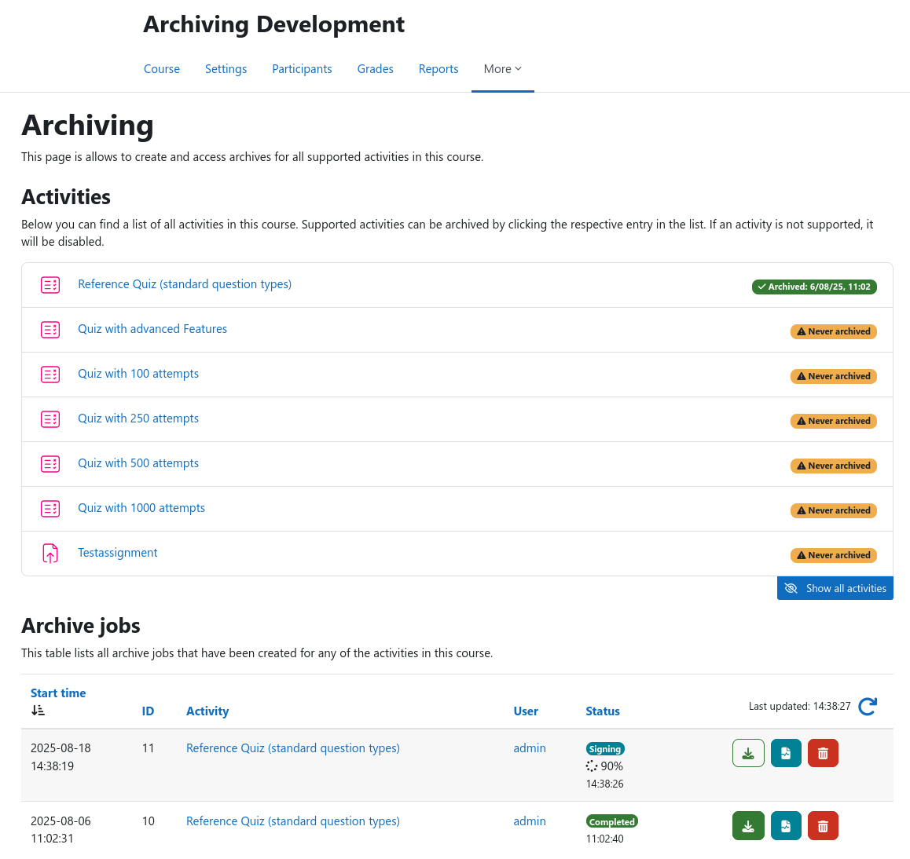

# Course Overview

This plugin provides a comprehensive archiving overview page that lists all archivable activities within a Moodle
course. To access this page, navigate to a Moodle course in that you have at least trainer rights and click on
{{ moodle_nav_path('More', 'Archiving') }} inside the secondary navigation to open the archiving overview page.

{ .img-thumbnail }

In the top section, all archivable course activities are listed. For each activity, the respective status badge on the
right indicates when an activity was last archived. If an activity has changed since the last archiving (e.g., a new
quiz attempt was submitted), an additional warning will be displayed. You can use the _Show all activities_ button 
to also include activities that are currently unsupported. 

To [create a new archive job](archive-creation.md), click on the desired activity inside the list. This will take you to
the archive creation form for the respective activity.

The table at the bottom lists all existing archive jobs that target an activity inside the current course. You can use
the action buttons to the right to [download archives](download.md), [inspect logs](logs.md), or delete an archive job
including all stored data. The list can be refreshed using the blue arrow symbol at the top right.
